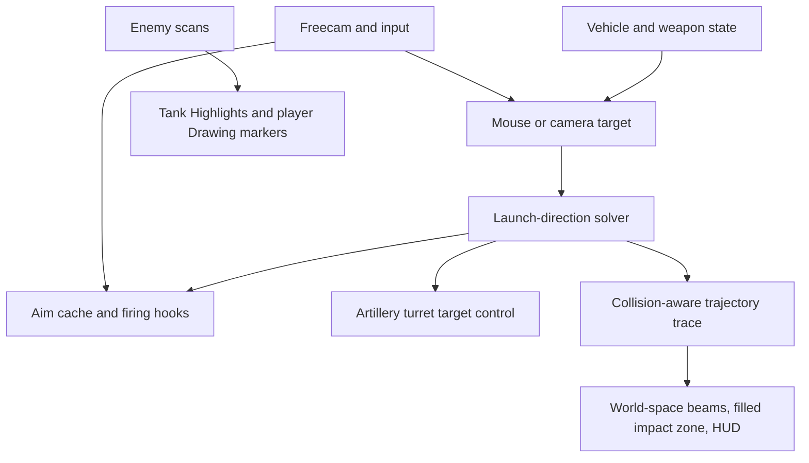

# AutoLeadAssist: Project Documentation

## 1. Overview

### Tank alignment and outline-only correction (2026-09-27)

Tank boxes/labels previously used viewport projection inside an inset-enabled ScreenGui, introducing a fixed downward screen offset that was especially obvious on small distant targets. They now use a dedicated `AttributeTankOverlay` with `IgnoreGuiInset = true`; the impact HUD layout is unchanged. Module outlines no longer use thin, depth-occluded world-space SelectionBoxes. They use 12 pooled screen-space box edges per module, visible through the hull independently of fill. Following visual feedback, the edges are now 1-pixel colored lines with no dark border; the whole-tank Highlight is unchanged. Tank distance fading no longer fades module outlines. Edges track each part's current transform/size, clip to the viewport, and hide behind the near plane. Existing module/vehicle caps and cleanup remain in place.

Full-source compilation and 23 isolated renderer assertions passed, including near/far projection, outline-only visibility, behind-camera/offscreen handling and object cleanup. Integrated box projection error stayed below one pixel (integer GUI rounding) at 20, 150 and 1,500 studs. Tests used temporary objects outside the live scene; the full script was not reloaded and live visual/FPS validation remains pending.

### Foliage, tank modules and shot notifications (2026-09-27)

- **World → Foliage:** No Grass / No Trees default off. Terrain grass decoration and recognized grass/tree mesh visuals are hidden only locally. Tree recognition includes map-scoped Pine/Tree/Oak/Birch/Palm names and their LOD variants. Originals are restored on disable/unload without overwriting later transparency changes by other code. Existing geometry is queued once per toggle/root change; streamed parts use root-local events and batches of at most 300 parts per 0.25-second update. No geometry is destroyed and collisions/raycasts remain unchanged. Unknown foliage naming is not guessed; unsupported terrain-decoration access appears in diagnostics.
- **ESP → Tank ESP:** whole-vehicle Highlights remain, with optional boxes, names, vehicle class, distance, distance fade, helicopter inclusion, occupied-only filtering and team checking. Team checking defaults on, extra labels/boxes/helicopters default off. Uses the user-controlled ESP range and nearest-16 cap. Helicopters require a recognized Type/VehicleClass attribute; no helicopter was available for live inspection.
- **ESP → Tank Modules:** separate Outline/Filled switches, Engine/Ammo selectors, two color pickers and an independent distance slider (400 studs initially). Marks real BaseParts inside `DamageModules.Engine` and ammo-named damage-module models, verified on the connected M109/T-80B. Uses translucent bounding volumes rather than altering module transparency or armor. These are component locations, not calculated penetrable weak spots. Styles default off; at most eight parts per vehicle and 32 total are marked. Geometry is refreshed on the 0.75-second vehicle scan, while cached bounds follow the camera each frame.
- **Trajectory → Shot Notifications:** replaces the persistent shot-status panel with silent VibeUI toasts after the existing own-shot dispatch confirmation (`id` and `effectfired`). Mouse/key input alone does not create a fired toast. Rapid dispatches are grouped at up to one toast per second. This confirms local dispatch, not server damage/impact; target ETA and flight visuals remain. Other utility notifications also prefer VibeUI, falling back to Roblox notifications if the library is unavailable.

Verification: full-source compilation and 22 isolated assertions passed for tank/module filters and cleanup, drawing properties, foliage restoration/independent toggles/collision preservation, and notification gating/batching. Temporary test objects were unparented from the live scene and destroyed afterward. No live shot, foliage change, teleport or full script reload was performed; appearance, streaming behavior and FPS still need an in-game check.

### Latest input/camera update (2026-09-27)

Added off-by-default on-foot freecam click teleport, held-fire repetition and a reversible active camera-spring sink. Full-source compilation passed without running the script. Isolated tests of the extracted code passed 22 input/fire/teleport assertions and six spring-wrapper assertions, including duplicate cooldown, release/focus/seat cleanup, return preservation, invalid teleport targets and callback restoration. These used mock firing and movement only. No real shot or teleport was performed, and this revision has not been reloaded into the live client; explosion behavior and server acceptance still need user verification.

**AutoLeadAssist** is a client-side ballistics preview, aiming, freecam, and enemy-marking script for *[MTC] Multicrew Tank Combat* (Roblox Luau).

It reads local vehicle, weapon, ammunition, and physics data to predict launch direction and impact. The preview is an estimate: map collisions, game-side projectile behavior, and server authority can make a fired shot differ from the displayed path. It does not give projectiles terrain or object noclip.

---

## 2. Core Architecture

The codebase (`attribute.lua`) has these main data paths:

### Subsystems Breakdown

1. **Input isolation and freecam**
   - Uses a scriptable camera and a late `BindToRenderStep` priority (`2,000,000`) so the normal vehicle camera does not overwrite freecam movement.
   - Sinks freecam movement keys with `ContextActionService:BindActionAtPriority` to avoid simultaneously steering the vehicle. It makes best-effort streaming requests around the camera; the game still controls what is replicated and rendered.

2. **Target acquisition (`getAimTarget`)**
   - Uses a fresh viewport ray from the current mouse pixel or the camera look vector. Freecam forces mouse aiming. Cursor aiming and zoom share the same viewport coordinate convention.
   - Outside freecam, first tests other vehicles and characters, then the visible world. In freecam, the first visible world surface wins so an obscured tank does not steal a ground aim point. Raycasts cover a 100,000-stud sightline in chunks. If nothing is hit, the sightline remains a direction rather than a finite ground target.
   - Nearby surface hits remain finite targets. The old under-150-stud rule that silently replaced a close ground hit with a barrel-elevation bearing has been removed.

3. **Launch-direction solver (`solveBallistic`, `getLaunchDirection`)**
   - For a finite target in normal auto-lead mode, uses the minus-sign (lower-angle) no-drag ballistic root:
     $$\tan(\theta) = \frac{v^2 \pm \sqrt{v^4 - g_{\text{mag}}(g_{\text{mag}} x^2 + 2 y v^2)}}{g_{\text{mag}} x}$$
   - Auto-lead uses the same automatic arc selection in normal view and freecam: choose a legal, clear low root first, then a legal, clear high root if the low path is blocked. `AutoBallistic` explicitly prefers a clear high root. Distance alone does not force a high arc or extend maximum range. With horizontal drag, the solver searches the legal elevation interval numerically. A blocked path, unreachable elevation, or out-of-range target is reported.
   - When the player occupies the matching gunner seat, freecam artillery can feed the chosen direction to an FCS-equipped turret through the game's `Gunner.Weapons.Data.TargetPos` control. It yields to another nonzero target owner and clears its own value on exit or unload. Guns without FCS—including the tested 2S19 and M109—are not automatically slewed. High-arc assistance requires the barrel within about 3° of the chosen direction in either camera mode. Low-arc correction uses the same forward-bearing guard in both modes.
   - An unreachable finite target has no assisted solution; there is **no automatic 45-degree fallback**. Open sky preserves the barrel elevation and uses the cursor bearing. Direct firing falls back to the actual bore when assistance is unavailable, matching native gunner fire. Near-backward assisted directions are rejected.

4. **Collision-aware trajectory trace (`traceTrajectory`)**
   - For shells without drag, uses the analytic parabolic position at each preview sample to avoid integration drift. Dragged shells retain stepwise integration. Raycasts are batched across the path using the `Projectile` collision group where available.
   - The preview now updates on rendered frames after the freecam camera step. It reuses raycast settings and skips unchanged traces for up to 0.2 seconds; cursor, barrel, or target movement invalidates that cache immediately. It uses 8–120 simulation steps and can look ahead up to 60 seconds in barrel-lob mode.
   - It stops at the first raycast hit, including queryable map colliders. A planned path can remain visible without an impact in the preview window; the HUD and red impact cue distinguish that case from a confirmed hit.
   - The displayed beam is a cubic approximation between the simulated launch and endpoint, not a guarantee of the server projectile's full path.

5. **Visuals and ESP**
   - Two reusable, engine-rendered world-space `Beam` objects show the actual bore path and the planned assisted path. The selected path starts at the muzzle and terminates at the filled impact cue, including when freecam is active. Its color follows the cue; an optional secondary bore path remains purple.
   - An unreachable finite cursor target retains a red marker at that point and shows `NO VALID ARC TO CURSOR`. When an otherwise legal arc is obstructed, a display-only red trajectory stops at the obstruction and reports `PATH BLOCKED`; that candidate is never supplied as a valid firing direction. Neither case automatically switches to the bore trajectory. The explicit Barrel Path toggle can still show the bore. A compact distance label beside the zone gives muzzle-to-marker distance in metres, controlled by Show Distance.
   - One thin, non-colliding cylinder displays a compact **filled** impact zone. Blue requires a clear path and local firing readiness; green additionally means a person or other vehicle is within the estimated blast radius. Red includes blocked/unreachable paths, required high-arc alignment, empty ammunition, unavailable firing control, damaged gun parts, barrel clipping, or spawn protection. Local readiness does not confirm server acceptance; actual launch status is displayed separately.
   - Own-shell tracking passively observes pooled projectile Parts and Attachments. It associates a dispatched local shot with a matching model, spawn time, muzzle position, and direction; this is a visual association, not a server shot-ID match. There are no repeated garbage-collector searches. At most four shots and 24 discovery candidates are retained, with bounded discovery windows and disconnected callbacks on cleanup.
   - Each observed shot keeps its original target when the cursor moves. Flight progress uses 49 pooled screen-space line segments per shot (four-shot cap), not the preview's world-space Beam. A subdued full forecast fills cyan-to-lavender behind the measured shell. Passed waypoints are committed from observed movement; the untraveled forecast is joined to the current shell with a correction that tapers to zero at the original target. The remaining path and ETA are predictions, not confirmed future flight. Flight strokes use a one-pixel core with a faint two-pixel backing to reduce visual weight. Geometry updates after camera transforms every render; label content remains capped at 20 Hz. Near-plane and viewport clipping prevent behind-camera streaks. Impact labels retain their tight faint backing and distance-dependent font size.
   - Finished shot visuals are removed in the same render update, not retained for five seconds. Arrival can be observed by the shell's sampled movement crossing within eight studs of a predicted collision endpoint after at least half its estimated flight time. Pool return/despawn also ends tracking. No movement for 1.5 seconds ends tracking as lost, not as a confirmed arrival; lifetime expiry is bounded. The bottom-left terminal status lasts two seconds. The separate live aiming preview remains visible.
   - Own-shell ESP uses an outline-only native Highlight on the actual projectile BasePart (or an Attachment's immediate BasePart parent), not an enlarged proxy ball. Unsupported, fully transparent, or sub-three-pixel targets use a five-pixel hollow cyan ring with a one-pixel stroke. No ancestor model is highlighted. Attachment coordinates remain world-space; OwnShellHighlight controls both mutually exclusive indicators independently of ShotProgress. Both are cleaned up with the shot; no projectile physics or size is changed.
   - The bottom-left readout distinguishes `INPUT RECEIVED`, `SHOT SENT`, `SHELL LAUNCHED`, and `NOT FIRED`. Dispatch without a matched object reports `FLIGHT UNOBSERVED`. Progress follows observed position, not just a timer. A visual projectile ending near the predicted target reports `ARRIVAL OBSERVED`; early disappearance or stalled tracking is reported separately. Visual arrival does not prove a server hit or damage. ETA is an estimate and becomes unavailable when tracking stalls.
   - A fixed bottom-left HUD shows impact distance/elevation and flight time or cursor offset. It is not a cursor-following billboard.
   - Tanks use subtle Roblox `Highlight` outlines/fill, with optional cached-bound boxes and compact labels; damage-module marking is separately toggleable. Enemy players use the isolated [Attribute fork of tulontop/esp-lib.lua](https://github.com/eduardonash/esp-lib.lua), authored by tul (@.lutyeh): togglable Drawing boxes, names and health bars. No player distances, tracers or weapon labels are added. The runtime URL is pinned to fork commit `e44b14b4d642c8d24388d876204293e4f8a83389`; the library does not overwrite global ESP settings or create its own render connection in this integration.
   - Player bounds enclose actual body parts, including R6 legs and R15 feet, instead of estimating height from HipHeight. Accessories and tools are excluded to avoid oversized boxes. Cached membership refreshes every 0.5 seconds; animated transforms are read each frame, combined into one conservative body-aligned box, then projected at eight corners. Offscreen corners still contribute to the bounds; near-plane intersections are hidden to avoid huge invalid boxes. One shared bound drives the box, name and health bar. Five Drawing objects are allocated per tracked player, with a 24-player cap and explicit removal on death/respawn/unload. Updates run after freecam/zoom to avoid camera-frame offset; tank Highlights remain independent.

---

## 3. Mathematical Models & Formulae

### Ballistic drop and launch-vector resolution

- $x = \text{distXZ} = \sqrt{\Delta X^2 + \Delta Z^2}$
- $y = \Delta Y$
- $v = \text{MuzzleSpeed}$ (studs/s)
- $g$ comes from the shell or MTC constants when available; the fallback is $-49\text{ studs/s}^2$.
- The closed-form root ignores drag; indirect aim with dragged shells uses a bounded numeric pitch search. The dragged-shell preview applies horizontal drag with $\vec v_{t+\Delta t}=\vec v_t+(0,g,0)\Delta t-d\Delta t(v_x,0,v_z)$ and $\vec p_{t+\Delta t}=\vec p_t+\vec v_{t+\Delta t}\Delta t$.

### Blast-radius estimate and compact cue

The script prefers `GlobalConstants.GetExplosionDiameter(shellData)`. Its fallback diameter is:

$$D = \min\left(\frac{10}{c}\left(\frac{m}{\rho}\right)^{1/3},\;500\,\text{ExpCapMult}\right)\text{blastradiusmult}$$

where $c$ defaults to $0.07$, $\rho$ to $1.2$, and $m$ is `ExplosiveMass`. The actual radius estimate is $D/2$ after shell modifiers. The **displayed** disc radius is capped at 24 studs (minimum 6) to reduce clutter; it is a status cue, not a scale-accurate blast footprint. Occupancy checks still use the uncapped radius.

- HESH multiplies the diameter by `0.8`; HEAT multiplies it by `0.66`.
- Shells without positive `ExplosiveMass` get no blast cue.

---

## 4. Configuration & User Interface

The settings menu uses [VibeUI](https://sirmemegithub.com/RealSlimShady2000/VibeUI), loaded from its published single-file Luau source at runtime. Features are grouped into **Aim**, **Trajectory**, **Freecam**, **ESP**, and **Armor** tabs; VibeUI also adds an interface/theme/configuration tab. The bottom-left impact readout remains a separate lightweight overlay. If the library cannot be fetched or built, the aiming and visual logic still runs, but the settings menu is unavailable until a successful reload.

### Theme Palette

| Element | RGB | Hex |
| :--- | :--- | :--- |
| Background | `20, 22, 26` | `#14161A` |
| Card Background | `28, 30, 36` | `#1C1E24` |
| Accent / Toggle Active | `135, 110, 255` | `#876EFF` |
| Bore Trajectory | `155, 48, 255` | `#9B30FF` |
| Planned Trajectory / Clear Zone | `65, 210, 255` | `#41D2FF` |
| Occupied Zone | `70, 235, 165` | `#46EBA5` |
| Invalid Shot / Zone | `255, 90, 125` | `#FF5A7D` |
| Flight Fill Start | `65, 225, 255` | `#41E1FF` |
| Flight Fill End | `177, 135, 255` | `#B187FF` |
| Contrast Outline | `12, 16, 26` | `#0C101A` |

Impact and shot-readout labels use bright text with a dark stroke over a faint dark backing (72% transparent) and no border. World-label backgrounds automatically fit their text with only three pixels of horizontal padding, one pixel of vertical padding, and two-pixel corners; they do not fill the billboard canvas. The surrounding containers stay transparent. World labels shrink with camera depth and grow with zoom, bounded for readability. The settings menu is unchanged; the trajectory retains its cyan-to-lavender fill.

### Settings

- `InfiniteAmmo` defaults **off** and is remembered across reloads. **Aim → Assist → Infinite Ammo / No Reload** gates the previous always-on local reload suppression. Off preserves native callers' reload flags; direct F/driver shots request normal unloading. On forces the local flag false. It does not replenish server ammunition, reload an already empty weapon, or bypass other firing checks. Changes apply to subsequent shots without reinstalling hooks.
  - Magazine-based gunner controllers also debit a separate local ammo table after a successful handler return. The toggle now snapshots the exact caller-owned table and defers reconciliation until that debit has run. It requires both a successful native return and an observed dispatch, and restores only matching single-step decrements. Direct calls without that state, unsupported layouts, overlapping bursts, reloads, changed owners/vehicles, disabled settings and unload are left untouched. No fixed upvalue indices, GC scans, repeated refill loop or additional firing calls are used. Errors and restored/skipped counts are exposed under diagnostic `ammoReconcile`. This remains client-side behavior, not a guarantee of server ammunition or accepted damage.

- `DisableExplosionShake` defaults on and is remembered. **Freecam → Camera → Disable Explosion Shake** suppresses named/default explosion camera shake and the mass-based helper shared by impacts and flybys. When both shake switches are on, a reversible wrapper also neutralizes the active ClientVisualizer camera spring, including delayed impulses and its RecoilAimOffset. This needs connection/upvalue inspection support; `cameraShakeSink` diagnostics report attachment/error. Individual switches retain source-specific suppression. Damage, sounds, particles, physical recoil and camera navigation are untouched. Unload restores only callbacks still owned by Attribute.
- **Freecam → Camera → Click Teleport (on foot)** starts off on every load. Enable freecam and this switch, then Alt + left-click visible ground to move only the living, unseated character. The camera stays put. Sky/wall hits, insufficient headroom and rapid repeated clicks are rejected; the ray is limited to 15,000 studs and locally available geometry. This is not collision-proof placement or a guarantee of server acceptance. There is no detection-avoidance mechanism.

- `DisableFiringShake` defaults on and is remembered across reloads. The **Freecam → Camera → Disable Firing Shake** toggle zeros only the three client-side cannon muzzle-shake presets (`RecoilShake`, `RecoilShake2`, `RecoilShake3`). This also suppresses nearby cannon muzzle shake using those presets, but leaves explosion shake, physical recoil, firing, and camera controls unchanged. Original values are restored on disable/unload unless another owner changed them. No render loop or new firing hook is added. Diagnostics expose availability and errors; unsupported preset layouts fail without repeatedly retrying.

- `EnableAutoLead`, `Trajectory`, `AutoLead`, `ShowBallistic`, and `AutoBallistic` control the aiming assist and bore/lead previews. `AutoBallistic` defaults off; the others default on except `ShowBallistic`.
- `ExplosionRadius` toggles the compact filled impact-zone cue; `ShowDistance` controls both the zone distance label and bottom-left distance readout. `FlightTimer` controls flight-time information.
- `OwnShellHighlight`, `ShotProgress`, and `ShotStatus` independently toggle own-projectile highlighting, the flight completion path, and shot confirmation. They default on and are remembered across reloads.
- `EnemyTankESP`, `PlayerESP`, `ESPNames`, `ESPHealth`, and `ESPBoxes` are separately toggleable and default on. Player ESP draws a projected body-size outline, name, and narrow health bar; enemy tanks use engine Highlights. Enemy filtering excludes the local player's team and neutral players. The scanners cap active markers at 16 nearby tanks and 24 nearby players.
- `ESPColorIndex` selects red, cyan, yellow, or purple. `ESPMaxDistance` is a VibeUI slider with an editable value box: any whole-stud distance from `0` to `50,000`, rather than four presets. There is no ESP distance-label toggle.
- `AimSource` starts as `"Mouse"` and can be changed to `"Camera"`; active freecam forces mouse aiming.
- `Freecam` starts off. `FreecamSpeed` starts at `3.5` and is adjustable from `0.5` to `20`. Freecam and zoom keys can be rebound in the Freecam tab. Zoom follows the cursor while preserving the world ray under it; the previous camera adjustment is removed before the next camera update to prevent drift. Zoom starts off; its field of view defaults to `25°` and can be adjusted from `10°` to `70°`.
- `ZeroEnemyArmor` defaults on. It sets the client-visible `ArmourValue` and related composite/HEAT/slat resistance attributes to zero for enemy tanks only, tracks newly spawned plates, and restores original local values when disabled or unloaded. Server-side hit and damage rules may ignore these local changes.
- ESP, armor, keybind, freecam-speed, zoom-FOV, and `AutoBallistic` choices are remembered across script reloads in `_G.AutoLeadAssistRemembered`.

---

## 5. Controls & Keybinds

| Key / Input | Action |
| :--- | :--- |
| `Right Shift` / `Insert` | Toggle the VibeUI settings menu |
| `V` (rebindable) or freecam toggle in settings | Toggle freecam navigation |
| `Z` (rebindable) or zoom toggle in settings | Toggle camera zoom |
| `W, A, S, D` (Freecam) | Move Camera (Isolated from chassis) |
| `Space` / `E` | Elevate Camera Up |
| `Left Control` / `Q` | Lower Camera Down |
| `Right Mouse Button` (Freecam) | Hold to rotate the camera; release to move the cursor freely and choose a shot location. Enabling freecam closes the menu. |
| Arrow keys (Freecam) | Alternate look control |
| `Left Mouse Button` / `F` | Native gunner click; `F` or driver click can use direct fire when a valid shot code was previously observed for that vehicle |
| `Left Shift` | Boost Freecam Speed ($\times 2.5$) |
| `Left Alt` | Slow Freecam Speed ($\times 0.3$) |

---

## 6. Firing and limitations

The firing hook updates replicated shot directions from a frame-synchronized aim cache when alignment is safe. Camera mode does not change the arc-selection or firing gates. High lobs still need barrel alignment; if assistance is unavailable, direct fire preserves the bore direction instead of rejecting the input. The preview labels an unavailable assisted target red. Driver-seat direct fire remains conditional on a valid shot code already observed for the **same vehicle**. It does not automatically grant a gunner role or provide the driver's turret-slaving input. Server-side ammunition and firing rules remain authoritative.

The preview deliberately honors terrain and map collider hits. A line ending before the cursor can therefore mean the predicted projectile hit an obstruction. When no legal path exists to a finite target, the red cue remains at the requested target and no valid assisted trajectory is drawn; it is not a predicted impact. The script cannot promise that a projectile passes through buildings or terrain.

The 2S19 gun tested here allows roughly $-3^\circ$ to $52^\circ$ of elevation. With `3OF45 Proxy High Charge` at about 2,000 studs, the mathematical high root is near $89^\circ$ and cannot be reached by that turret. The solver should then use a legal clear low arc if one exists; it cannot make a high arc over an intervening building without a suitable charge, range, or weapon elevation.

## 7. Live test status (2026-09-24)

- The current file executed in a fresh connected client without a new AutoLead runtime error. Re-execution left one settings UI, one visual container, two beams, and four beam attachments—no duplicate visual instances.
- Tank `Highlight` instances and player ESP tracking were active. In a BMP-3 2017, the main-gun preview ran in gunner and driver seats; driver diagnostics reported the firing hook and direct-fire prerequisite as ready.
- For a finite unobstructed target, sampled predicted impact error was about `0.2` studs. Another sample stopped on `Workspace.Map.MapParts.Destructibles.Pine_big_2LOD0.propCollision` about `801` studs before the cursor target.
- Those earlier checks did **not** verify a fired shell against the preview. The Roblox window capture returned a blank frame, so final on-screen appearance was not visually confirmed at that stage.
- A later live load of the frame-synchronized preview completed without a new AutoLead runtime error. Sample aim/trace work was below 1 ms combined, but this is a local sample, not a measured game-FPS improvement. Cursor-motion appearance still needs visual confirmation in the game window.
- The VibeUI migration loaded with all 17 feature controls in the connected client. Setting ESP distance to a non-preset `3,456` studs updated the live script setting; it was restored to the previous `3,300` studs after the check. This validates the control callback, not the on-screen appearance of every tab.
- The new script loaded in the connected client with the Armor tab and no AutoLead warning. Diagnostics reported 598 client-visible armor values across 12 enemy vehicles set to zero, while friendly vehicle samples retained their values. A `Drawing` Square creation probe succeeded. Weapon damage, key presses, zoom appearance, and ESP scaling were not verified on screen.
- The latest freecam check confirmed that enabling it closes the menu, uses a `Scriptable` camera and mouse aim source, and leaves the cursor at `Default` so it can select a shot location. Holding RMB is intended to lock temporarily for camera rotation; physical RMB movement was not verified through MCP. Disabling freecam restored the normal camera and `Default` cursor instead of the stale `LockCurrentPosition` mode.
- The reconnected 2S19 live probe confirmed its `TurretInfo.FCS` is absent, just like the M109. Therefore an earlier $0.62^\circ$ barrel movement during a brief `TargetPos` probe did **not** establish that this control slews the 2S19; concurrent manual movement was possible. The script correctly reports `aim barrel to target arc` on this gun. A direct legacy-turn fallback was tried only in the live working copy, but the client disconnected before it could be validated; it was removed from the deliverable. The revised script loaded without a new AutoLead console error and returned an analytic preview error under `0.001` stud for one near finite target.
- On the reconnected client, the saved script loaded cleanly before seating. In the 2S19 gunner seat with `3OF45 Low Charge`, freecam mouse targeting was active. A visible `SpawnProtectors.Eagle Federation` hit at about 5,107 studs produced a legal low arc near $25.2^\circ$, while the barrel initially stayed near $1.9^\circ$ and the assist reported `aim barrel to target arc`. The player manually raised the barrel to about $25^\circ$ without leaving freecam; the assist then reported `ready` and its predicted terrain endpoint was within about `0.001` stud of the cursor target. One player-fired low-charge shot at about 5.2k studs reported `applied=true` in the firing hook, and the player observed that it landed close to the cursor.
- For the high arc, the cursor hit `Workspace.SkyboxLoaded.Part` around 6,700 studs. The solver selected a legal launch near $47.9^\circ$, and the player manually elevated the barrel to about $48.1^\circ$. The assist reported `ready`, with a computed preview endpoint within about `0.003` stud of the selected point. The player-fired shot was assigned an elevated direction by the firing hook, and the player observed that it landed close to the cursor after its roughly 17-second flight. The on-screen landing was user-observed, not independently measured by the MCP.
- The revised filled zone and beam were loaded in the connected client without a new AutoLead runtime error. In freecam at a nearby invalid artillery aim, the red zone and bore beam were both visible. For a reachable but not-yet-aligned distant aim, live diagnostics showed the planned beam and a blue/green zone instead of falsely marking it red. Their world-space endpoints differed only by the zone's deliberate `0.18`-stud surface offset. The Roblox window capture was blank, so the final visual appearance still needs player confirmation.

### Follow-up tests (2026-09-25)

- The player confirmed that the earlier freecam trajectory connects to the filled zone and the zone changes blue/green. The new revision tightens those colors to include firing readiness after a further report that a blue planned path could still refuse a shot.
- Live projectile tracking observed a player-fired shell, matched its game projectile state, and reached an impact state. Another rejected attempt reported `NOT FIRED` with an alignment reason. The low-arc freecam-only alignment rule causing that rejection has since been removed; the same-point firing retest is pending.
- Isolated calls to the active solver at 500 studs/s and 49 studs/s² gravity chose low arcs for 250 and 4,500 studs, a high root when explicitly preferred at 4,500 studs, and rejected 6,000 studs as out of range.
- Cursor-zoom ray preservation was checked at four viewport offsets; the maximum direction-vector error was approximately `6e-8`. The live zoom binding also applied its camera transform and 25° FOV, with zero sampled cursor-ray error, then zoom was switched off. Final cursor-follow appearance still needs player confirmation.
- The revised script loaded in the M109 and T-80B client without a new AutoLead runtime error. The client disconnected before the final normal-view/freecam firing comparison; that retest remains pending. The final small change making trajectory colors update even with the blast cue disabled was reviewed locally but was not reloaded before disconnection. These tests do not establish server damage or guaranteed hits on moving targets.

### Shot-progress follow-up (2026-09-25)

### Vehicle utilities and group notifications (2026-09-27)

Pickup audit removal: at the user's request, removed the audit button, readout, snapshot functions and diagnostic fields described in the historical entry below. Supplies now retain only the two station pickup buttons and their station-required note. No verified item-grant remote has been identified or added; normal range checks remain unchanged.

Read-only pickup audit: **Vehicle → Supplies → Check Pickup Availability** refreshes a local snapshot in the Pickup Audit paragraph. It reports nearest AmmoPallet/Fuel model-pivot distance, declared click range, supported station count (diagnostics), local request availability, and whether AmmoCrate/Jerrycan Tools are already in Backpack/Character. It distinguishes missing stations/character, dead characters, out-of-range pickups and missing click activation support. In-range status does not confirm a grant; inventory presence does not establish remaining contents. Every report explicitly marks server validation UNKNOWN. No activation, movement, remote call or per-frame audit loop is added, and the existing pickup handler/range guard is unchanged. The last snapshot/error is available in normal diagnostics as `pickupAudit` / `pickupAuditError`.

Audit verification: full-source compilation and 11 isolated assertions passed, including empty/missing stations, range boundary, death, unavailable activation, inventory presence and missing character; the activation spy recorded zero calls. A separate read-only live audit returned both stations outside their 32-stud ranges (about 47.5 studs for ammo and 34.5 for fuel at that instant). No pickup was attempted and the full script was not reloaded during verification. UI appearance after reload remains user-verifiable.

UI follow-up: corrected both supply buttons and Check Current Server to VibeUI's `section:Button():Add(name, callback)` API. The earlier `Button({Name=..., Callback=...})` calls created empty button rows rather than clickable controls. Verified against the locally available library implementation and demo; no live reload, pickup, teleport or remote request was performed for this fix. Client-visible ClickDetector activation ranges are not evidence of private server validation or anti-cheat behavior; neither remote grants nor teleport pickups have been verified as accepted or detection-free.

- **Vehicle → Supplies:** Give Ammo Crate / Give Jerry Can activate an existing nearby `Workspace.Map.ToolGivers` AmmoPallet/Fuel ClickDetector only within its normal activation distance, with a one-second request cooldown. The server decides whether a tool is granted. No teleport, fabricated tool clone or remote item grant is used. Missing stations/activation support report a notification; requests are not reported as confirmed grants.
- **Vehicle → Turret & Firing:** off-by-default, remembered Turret Rotate Speed toggle and 0.25–3x slider scale horizontal/vertical speed entries in the occupied turret's `TurretInfo.anglelimits` and FCS configurations. Native elevation/bearing limits remain unchanged. Tank Rapid Fire with a 1–5x multiplier reduces supported shell-table `RPM` delays. Hold left-click or F while seated for repeated fire requests; one controller and a shared handler cooldown avoid duplicate native/direct requests, capped at ten repeat requests per second. Release, focus loss, text entry, death, disabling the toggle or changing seat/weapon stops repetition. Normal weapon checks still apply, and direct repeats require an observed shot code for that vehicle. Server ammo/reload rules are not bypassed. Native loops may retain a captured interval until release/repress.
- Local tuning is checked at 4 Hz and restores owned values on disable, seat/weapon change, or unload. Later changes by another writer are preserved. Frozen/unsupported tables are skipped. Diagnostics expose active local edits and errors.
- **Server → Group Roles:** notification-only Staff Detection, Content Creator Check, and Check Current Server. Verified public group 32966202 roles on 2026-09-27: Moderator, Non TC Dev, Game Admin, TC Dev, Administrator, Holder; Content Creator is classified separately. Regular members, boosted/event/veteran roles and Automaton are not treated as staff. Source: https://groups.roblox.com/v1/groups/32966202/roles . Matching is by role name, not a broad rank threshold. This cannot identify unlisted/alternate staff accounts.
- One throttled worker checks existing players and new arrivals, caches successful role reads and deduplicates notifications. Manual checks request roles again (Roblox may still cache them). Lookup failures are unknown, not proof of no staff. No auto-leave or other automatic detection action is implemented; connections and queued work stop on unload.
- Verification: full-source compilation and 20 isolated assertions passed for reversible speed/delay edits, repeated updates, multiplier changes, seat exit, conflict preservation, frozen tables, role classification and supply range/type gating. No live weapon was fired, station clicked, or script reloaded during implementation. Live grant success, native cadence, turret response and menu appearance remain unverified.

### Earlier shot-progress history

Thin-style follow-up: reduced flight strokes from two to one pixel and their backing from 3–4 to two pixels at lower opacity. Removed the ForceField ball; added actual-projectile Highlights with the hollow-ring fallback above. Full compilation and nine isolated assertions passed for thickness, Highlight selection, transparency/size fallback, feature-off behavior and Attachment parent handling. Visual appearance still requires a live user check; the script was not reloaded by the assistant.

2026-09-26 renderer revision: replaced subpixel flight Beams with pooled outlined screen-space segments, measured completed waypoints and an observed-shell marker. Full-source compilation passed. An isolated harness exercised 301 frames with moving camera and off-forecast shell positions, fixed pool size, marker projection within one pixel of GUI integer rounding, feature-off visibility, near-plane clipping, behind-camera rejection and teardown. No per-frame Instances are created by the flight renderer. This is not a live artillery accuracy or FPS benchmark; the live script was not reloaded and no weapon was fired during these tests.

The first revision still delayed or missed shell discovery, and the user reported dark text. The corrected revision removes gradients from text labels and replaces repeated projectile-state searches with passive Part/Attachment observation. The live client subsequently reported three dispatched shots and three observed shells; one nearby shell ended within about 0.8 studs of its predicted endpoint. This verifies detection in that client, not server damage. Long-flight filling, frozen-target appearance, and final readability still need user visual confirmation. No shots were fired by the assistant.

## 8. Cleanup and diagnostics

### Optional ammo/reload suppression (2026-09-26)

Confirmed from the current weapon-handler source that its fifth argument controls the local unload transition and FireUnload request. Added an off-by-default toggle instead of always overriding this argument. Full-source compilation and isolated argument/return-preservation tests passed for true, false and nil native flags with the toggle on/off. No live shot was fired, and this revision was not reloaded during implementation.

Gunner magazine follow-up: native `TurretsNew` source independently decrements its captured weapon ammo table and `Mag` after the handler succeeds, explaining why reload suppression alone differs from direct driver firing. Added guarded post-return reconciliation for magazine-based callers. Full-source compilation and 12 isolated mocked-state assertions passed (matching debit, disabled toggle, direct caller, empty magazine, unload, changed vehicle/owner, burst, reload and absent debit). No weapon was fired by the assistant. The connected client switched to a Grad during inspection; PT-76E live verification is still pending. Bursts or other counter changes that do not exactly match one native decrement are deliberately skipped.

### Player ESP library integration (2026-09-26)

Forked `tulontop/esp-lib.lua` to `eduardonash/esp-lib.lua` and preserved author attribution and the upstream README's permission statement. Corrected full-body/offscreen bounds and added isolated/manual-update/remove/unload APIs. No new formal license was invented. Attribute loads an inspected immutable fork revision. If the library cannot load, player ESP reports unavailable while tank Highlights remain independent.

Both sources compiled. Isolated tests passed for R6 head/feet coverage, rotated 15-part body coverage, partial viewport intersections, camera refresh, near-plane hiding, five Drawing objects for the selected features, and idempotent cleanup. These tests do not establish game FPS improvement or final live-player appearance.

### Moving-camera zoom correction (2026-09-26)

The earlier angular-proximity restore heuristic proved unreliable in user testing, including on foot. It has been replaced: the late zoom transform is presentation-only, and its exact saved camera pose/FOV is restored before the next input/camera update. The normal camera controller then computes movement before one new cursor lens transform is applied. There is no angle-based ownership guess or residual integration. Shortest-arc ray rotation replaces the paired lookAt frames to avoid extra roll. Mouse pixels are bounded to the viewport, native FOV changes are captured, and camera swaps/disable/freecam entry restore the owned pose.

Full-source compilation passed. An isolated harness running the actual zoom callbacks passed 1,800 frames across three FOV modes, with position/orientation/FOV changes, cursor sweeps and perturbations. Maximum cursor-direction error was about `2.5e-7`, with zero restore or position error; callback cleanup passed. This supersedes the earlier residual-preserving zoom approach. The test does not establish compatibility with every third-party camera writer; user testing is still needed for moving tanks and on-foot controls.

### Explosion shake follow-up (2026-09-26)

After the user clarified that shell detonation triggers the movement, added a separate explosion/flyby camera-shake toggle rather than relying on muzzle presets or zoom correction. Full-source compilation passed. Isolated tests passed for explosion/mass suppression, recoil pass-through, restoration, repeated toggling, preserving another owner's replacement and disabling retained wrappers on unload. This revision was not live-fired or reloaded during implementation.

### Zoom/recoil interaction follow-up (2026-09-26)

The preset toggle was active in the inspected client, but shell flyby and explosion effects use a separate mass-based shake path. Zoom previously removed its lens rotation only when the camera CFrame exactly equaled its last output; even small external camera changes could leave the lens rotation applied for another frame. Restoration now runs before the normal render priorities, preserves small residual rotations and world translation, and avoids undoing a pose already replaced with an unzoomed view. This ownership check compares angular proximity and is not a universal guarantee for arbitrary third-party camera controllers. Restored/applied rotations are orthonormalized to prevent matrix drift. The same cleanup handles zoom disable, camera replacement and freecam entry.

Isolated testing of the actual restore helper over 600 simulated recoil frames produced a maximum direction error around `1.2e-5` against the expected recoil-only view. A replacement-camera-pose test passed. This is not a live firing verification; flyby/explosion shake remains intentionally separate from the muzzle-preset toggle.

### Firing shake option (2026-09-26)

Live source inspection confirmed that cannon muzzle effects call `vfxHandler.ShakeCam` with recoil presets, separately from explosion shake. The new toggle compiled successfully. Isolated preset-table tests passed for suppression, explosion preservation, restoration, repeated toggling, and respecting later changes by another owner. No live shot was fired and the full script was not reloaded during this update; final on-screen behavior remains unverified.

### Shot cleanup, text and zoom follow-up (2026-09-26)

Removed the five-second finished-shot retention and detected object-pool teleports before reparenting. Completed/lost shots now remove their path, target text, zone, and cosmetic shell together. The dot marker became a ForceField-material shell proxy. World label sizing runs independently of the cached ballistic trace, so camera movement still resizes text without forcing additional raycasts. Zoom now uses engine viewport rays at both FOVs instead of manual projection with an incorrect GUI-inset subtraction; aiming uses the same current viewport ray.

Verification: the full saved source compiled without executing it. Isolated tests of the actual shot-update callback removed arrived, despawned, stalled and expired entries, while retaining an airborne entry. Twelve isolated camera-projection tests across three FOV modes had a maximum direction-vector error around `3.8e-8`. These are isolated checks, not a live firing or final visual test. The full script was not reloaded because the recent executor disconnect cause remains unresolved.

### Render-capability error fix (2026-09-25)

Repeated `lacking capability Plugin` errors occurred while the render callback wrote the impact HUD under a protected UI container. The gameplay overlay now lives in `LocalPlayer.PlayerGui`, without GUI protection or elevated callback permissions. If the preview callback throws again, it records `preview.error` and `preview.stopped`, hides its visuals where possible, unbinds itself, and warns once instead of retrying every frame. Reload after correcting the recorded error. Pooled-shell reuse also explicitly disconnects the previous candidate's callbacks before replacing its record.

After reloading, live inspection confirmed one overlay in PlayerGui, an active preview callback, and no new capability error in the sampled console logs. This is not proof that every source of game stutter has been eliminated.

### Cursor-preview follow-up (2026-09-25)

The user requested restoration of the DTC-reported revision after a temporary rollback; that revision is the base for this fix. The earlier disconnect's cause remains unconfirmed. Live inspection in normal view showed a road hit only about 28 studs away being converted to `arc=barrel` and `finiteTarget=false`. Removing that conversion preserved a later nearby ground target as finite; its invalid arc showed a red marker and a `12 m` distance label with the bore beam disabled. A reachable target then showed a blue connected trajectory, a `150 m` label, and only the intended `0.18`-stud marker surface lift. The user confirmed that the trajectory follows the cursor correctly. The script loaded successfully; no shot was fired by the assistant.

`_G.AutoLeadAssistDiagnostics()` reports active seat/weapon, aim state, predicted hit/error/time, impact-zone color/visibility, shot dispatch/observation status, ESP counts, armor scan counts, and zoom state. `_G.AutoLeadAssistSetFreecam(true/false)` and `_G.AutoLeadAssistSetZoom(true/false)` control the camera features. `_G.AutoLeadAssistUnload()` disconnects loops and input/notification handlers, restores the camera, weapon hooks, and local armor values, and removes all tracked-shell visuals as well as the preview/UI. Re-executing the file calls the previous unload handler first.
