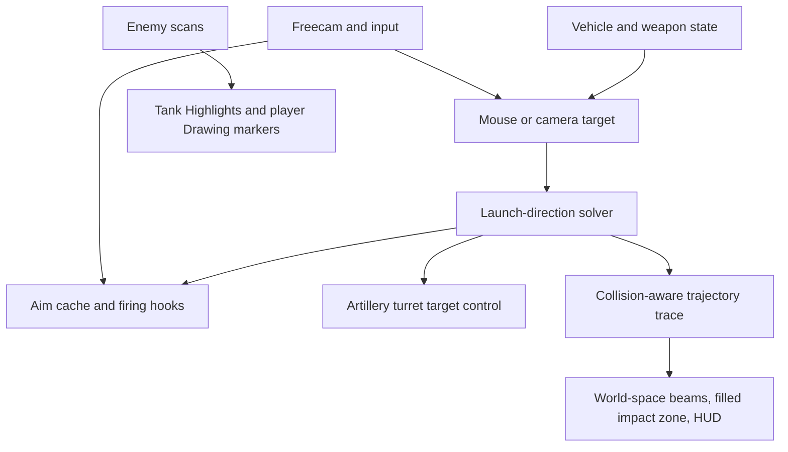

# AutoLeadAssist: Project Documentation

## 1. Overview

### Opt-in profiling and transport-only isolation (2026-09-29)

The user reported that a063dff still stuttered, and felt worse. Two client probes timed out; after reconnecting into a new session, read-only Roblox MCP inspection confirmed Attribute was not loaded. A bounded unloaded-client baseline captured 240 released-input frames over 3.49 seconds: mean 14.54 ms, maximum 26.89 ms, zero intervals over 50 ms. This is a baseline under those conditions, not a focused-player comparison or proof of the responsible subsystem.

The preceding build had a concrete instrumentation risk: native `debug.profilebegin/profileend` calls were unconditional when available, even for the inactive render callback, repeated unsupported calls after every failure, and excluded their own begin/end costs from reported scope durations. Native scopes are now **off by default** each load. Lightweight numeric counters remain. Explicit enablement uses `_G.AutoLeadAssistSetFocusProfiler(true)` or **Aim → Performance Diagnostics → Native Profiler Scopes (Test)**. Missing/throwing APIs disable and latch the scopes after one failure; only another explicit opt-in retries. Timings now include marker begin/end costs, and opened scopes retain their matching close function even if the global debug table changes. Installation remains marker-free because it can yield. No claim is made that these API calls caused the observed lag.

**Pause Steering Transport (Test)** in the same section, or `_G.AutoLeadAssistSetFocusTransportPaused(true)`, restores only owned transport/hook state and skips its Heartbeat work while preserving the Shell Redirection setting, held input, local target acquisition and focus visuals. Resume with the toggle off or the helper set to false. These test controls are session-local/default-off, not remembered gameplay settings. Pause/unload arriving during yielding Actor installation is checked before subsequent publication. Do not fire during this A/B test: steering is intentionally unavailable while paused. Owned hook cleanup can propagate asynchronously; let it settle before measuring.

`_G.AutoLeadAssistFocusTelemetry()` still returns the same cached table without raycasts, Instance traversal or fresh table allocation. It now includes `nativeScopes` (enabled/unsupported/calls/failures/error), cached `state` (build marker, held/engaged/focused player, flight activity, active-Actor count, publication writes, transport pause, ready Actors, tracked shells and dispatch count), and a reference to the existing `esp.timings` table. Active-Actor counts are event-maintained. ESP scan timings are the latest completed scan, not per-phase aggregates. Frame intervals are labeled by the focus state observed at the sample and do not establish causality for every preceding delay.

Isolation order: compare the reloaded build with native scopes off; compare transport running versus paused with the same keyboard focus key/camera and no shot; then compare ESP/module/armor scans and other visuals via their own controls. Only once a stable idle baseline is established should active-shell phases be measured. Held-empty spikes do **not** exonerate redirection: installed wrappers, host transport, ownership heartbeat/watchdogs and unrelated work can still run with no tracked shell. Sampling activity belongs to Actors observing eligible native own states; there may be several with simultaneous own flights. No owner-local transport redesign, velocity throttling, collision changes, server-check probing or anti-cheat changes were made without phase evidence.

Verification: full source compiled locally without execution; **315 assertions passed** (53 adaptive/native-fire, 177 redirection/acquisition/transport, 7 freecam navigation, 78 profiling/window). New tests exercise zero native marker calls by default, one-failure latching across repeated samples, explicit retry, marker costs inside scope durations, matched close-function retention, stable cached state; transport-pause idle dormancy, preserved input, resume and interrupted-install cleanup. An interrupted-install fixture exposed a real listener-registration race after `run_on_actor` yielded; a pause/unload check now precedes registration as well as publication. Protected failure tests retain the local-runtime modeling limitation documented below. Live improvement requires the user to reload this revision; no revised full source was executed through MCP.

### Flight-activated transport, allocation-light acquisition and profiling (2026-09-29)

Its always-enabled native profiler scopes are superseded by the opt-in instrumentation above; the flight gating remains.

Implemented the attached structural performance request without treating its GC/Actor-synchronization theories as established causes. A held-empty frame label does not identify exactly which work preceded that frame interval, and sub-2 ms measured Lua scopes cannot establish that all remaining delay is GC or Actor synchronization. The earlier worst-frame capture also predates the 96d5f90 held-monitor revision. Read-only inspection using the Roblox MCP skill confirmed the client still running `flight-gated actor-local target sampling`, six ready Actors, no tracked shell, zero preview rays and about 1.16 ms in the complete ESP callback at that snapshot. No revised full reload or shot was performed.

**Idle focus stays local.** Holding/searching with no own-flight activity produces no Actor Held/TargetId publications or 30 Hz targeting loops. The host subscribes to owner-token activity transitions from installed Actors and gates target/hold publication on native flight activity, with a 0.35-second warmup after a confirmed local native dispatch—not an input click or authoritative server acknowledgement. Release clears published state immediately when needed and makes no transport reads during truly idle focus. Activity subscriptions are disconnected on stop/unload; foreign ownership tokens cannot activate targeting. `flightActive`, `activeActors` and `publicationWrites` distinguish local focus from published flight targeting in diagnostics.

**Actors are sampling-dormant, not entirely unscheduled.** Native wrappers only record eligible own-state activity and steer from cache; they never schedule tasks or touch Instances. Executor-owned signals start a 30 Hz sampler only in an Actor that has observed a valid moving own shell beyond 15 studs from its origin. Empty Actors receive at most a one-shot deferred activity check after a genuine dispatch; they never enter a polling loop just because the focus key is held. Sampling ends when native activity expires. A shell already flying before activation may first announce activity on the next 4 Hz ownership heartbeat (up to about 250 ms); active focus acquisition then uses the sampler. Lightweight ownership heartbeat callbacks and one rescheduling lease watchdog remain while installed so lost ownership, stale heartbeat, abandoned setup and replacement native hooks clean up safely. These lifecycle checks are the explicit exception to literal "100% asleep" dormancy. The transport marker is `event-driven flight-gated actor sampling`.

**Acquisition reuses state.** Player membership is seeded once, maintained by PlayerAdded/PlayerRemoving events and refreshed into the same cached record/player arrays at 2 Hz; both event listeners are disconnected on unload. The 20 Hz search rejects behind-camera targets before viewport projection. With visibility checks off it uses a single nearest-record comparison without candidate insertion, sorting or temporary wrapper tables; ties retain the first roster player and the focus-radius boundary remains inclusive. Visibility-on mode preserves the bounded four-nearest-candidate collision checks. No new distance cutoff or ESP-range coupling was introduced. This removes recurring Lua table churn from normal search, not all engine/value allocation.

**Profiling is bounded and non-spamming.** Optional, protected native scopes are `AutoLead_Acquisition`, `AutoLead_FocusFrame` and `AutoLead_Transport`; acquisition includes membership/filter preparation. Scope counters expose count, total/mean/last/maximum milliseconds and >5/>50 ms counts. Failed protected calls still close their scopes. Installation has a separate elapsed-time bucket without a native marker, because executor setup can yield; a busy guard prevents overlapping transport callbacks. Frame-interval phase buckets (released / held-empty / held-target) reuse one 240-frame window, track count/mean/max/>25/>50 and window duration, and allocate no growing sample log. No warnings are emitted from these render paths. `_G.AutoLeadAssistFocusTelemetry()` returns the existing timing table without target raycasts, Instance traversal or new table construction; unload removes it. The full diagnostics also expose these counters. Classify idle held state from this local telemetry, not the Actor Held attribute, which intentionally remains false without an active flight.

RMB freecam camera movement, configurable lock keys, focus visuals and native weapon/collision behavior remain available. No server checks, gameplay remotes or anti-cheat controls were changed.

Verification: full source compiled locally without execution; **278 assertions passed** (53 adaptive/native-fire, 164 redirection/acquisition/transport, 7 freecam navigation, 54 profiling/window tests). Coverage includes zero idle hold/identity publication across 120 updates, no idle sampling/wakeup loop, lease timer reuse, actual-flight/warmup activation and expiry, already-flying acquisition, safe hook replacement and listener cleanup; behind-camera culling, tie/boundary handling, event-maintained roster membership; optional profiler failures, nested scope closure, installation/reentry separation and bounded window reuse across 1,440 additional samples. The local Luau-Web bridge cannot contain native thrown errors with its protected-call implementation; profiler failure cases explicitly use fixture-modeled protected-call semantics rather than claim to verify Roblox's native exception behavior. Local tests do not prove real FPS, scheduler behavior or accepted redirected impacts. Live improvement still requires user reload and the same controlled lock-on test.

### Idle-focus Actor isolation and restored freecam look (2026-09-29)

The flight-activated transport above supersedes this revision's held-driven 30 Hz cached-flag monitor. Its RMB restoration remains current.

The user repeated the test in a clean session without autoexec and still reported substantial redirection stutter. A read-only capture with six ready Actors, no tracked shell and visibility checks off finally reproduced long frames: released frames averaged 19.02 ms (29.95 ms maximum); 214 held-target frames averaged 26.12 ms, including eight frames above 50 ms and a 254.75 ms maximum. Acquisition included a 231.60 ms frame; one held-empty frame reached 312.65 ms. The complete ESP callback generally averaged about 1.8 ms while focused, though it also peaked at 41.85 ms. These are observations, not proof that any one component caused every pause.

The previous change wrongly disabled RMB freecam look when redirection used RMB. Normal RMB camera-look is restored regardless of the redirection toggle; released RMB keeps the cursor movable. Arrow keys and configurable keyboard lock bindings remain available. Choosing a keyboard lock key separates focus from RMB camera rotation. Tests now explicitly require camera movement with redirection enabled; the input-ownership behavior described in the older section below is superseded.

Actor target-change callbacks previously resolved/read the target character in every Actor even with no shell flying. They now only cache/invalidate identity and pose; no target lookup or pose read happens at installation or from attribute callbacks. The owned monitor alone samples a target when a recent eligible own-shell callback or increasing confirmed-shot counter warrants it. Native callbacks observe own-flight activity before the lock is held, preserving acquisition of already-flying shells. While held, the monitor checks cached flags at 30 Hz; idle hover does not resolve target Instances. Target/hold/owner loss immediately invalidates the pose, preventing steering toward the old target during acquisition. The startup lease and six-listener cleanup are retained. Diagnostics identify `flight-gated actor-local target sampling`.

The Roblox inspection skill guided the live capture and a temporary focus-visual isolation test. The circle, tracer and focused Highlight were hidden without disabling redirection, then restored with a targeted read confirming restoration and backup removal. The user reported continued stutter without those visuals. The second timing window contained only released frames, so it does not quantify that report or establish the Actor path as the sole cause.

Verification: full source compiled locally without execution; **196 assertions passed** (53 adaptive/native-fire, 136 redirection/transport, 7 freecam navigation). Added checks cover 100 idle identity/hold transitions with zero Actor target lookups/pose reads, no target access during setup, monitor-only confirmed-shot priming, acquisition after a shell is already flying, and immediate pose invalidation. No revised full live reload or shot was performed. Actual stutter reduction remains pending user reload and the same controlled test.

### Freecam input ownership and Actor startup lease (2026-09-29)

The idle-focus isolation and camera-look restoration above supersede this section's RMB restriction. Its startup lease fix remains current.

The latest identity-only transport was confirmed running, but the inspected client had already stopped redirection with `Projectile Actors did not confirm steering access`, zero ready Actors and no ownership/status attributes. Freecam was active, zoom was off, and there were no tracked shells. This snapshot cannot establish that active shell steering caused the remaining stutter. The client then reconnected into a new session without the script loaded, preventing a controlled live comparison.

Two concrete bugs were corrected. RMB previously both held focus and locked/recentered/rotated the freecam. When Shell Redirection is enabled with RMB as its lock key, freecam now leaves the cursor free and does not apply RMB mouse-look. Arrow keys still rotate the camera; choosing a keyboard lock key or disabling redirection restores ordinary RMB look. `shellRedirection.freecamRmbOwner` reports that ownership, and the UI explains the controls.

Serial Actor installation also used a stale frame-entry heartbeat, so setup lasting more than 0.75 seconds could make installed Actors restore themselves before readiness was confirmed. The host now publishes `Initializing`, refreshes its clock/heartbeat/confirmation timeout after all installation calls, then clears the setup flag. Actors allow at most eight seconds of setup grace, cannot steer during setup, and retain the strict 0.75-second running lease afterward. Ownership loss and unload still restore only owned hooks/attributes and disconnect all six listeners. The normal idle transport/sampling rate is unchanged.

`esp.timings` adds last measured player/tank drawing and roster/tank/armor scan durations, plus the complete ESP callback duration, in milliseconds. These are callback CPU timings, not GPU cost or proof that the observed screen hitch is fixed; scan values retain the last actual scan. Existing focus/update and frame-interval diagnostics remain available for a controlled follow-up.

Verification: full source compiled locally without execution; **181 assertions passed** (53 adaptive/native-fire, 121 redirection/transport/startup, 7 freecam input ownership). Tests cover delayed installation, fresh completion heartbeat, strict and abandoned-startup lease cleanup, no setup steering and exclusive RMB ownership. The Roblox inspection skill provided read-only live evidence and guided the distinction between cursor/input conflict and actual frame stalls. No full live reload or shot was performed. The remaining reported lag needs user retest; neither these tests nor the inspected failed runtime prove its full cause resolved.

### Focus-hover stutter: identity-only transport (2026-09-29)

The startup lease and RMB ownership changes above supersede this revision's five-listener lifecycle and simultaneous camera-look behavior.

Follow-up inspection confirmed the previous revision running with six projectile Actors, visibility checks/pre-shot previews off and no tracked shell. The user reported screen/camera/cursor stutter rather than shell motion; disabling the focused Highlight did not resolve it. A focused 360-frame sample averaged 12.24 ms, peaked at 26.93 ms and contained no >50 ms frame, with a 0.06 ms focus callback snapshot. These samples did not reproduce a long frame pause and do not disprove the reported hitch. The remaining moving-target attribute fan-out was removed as an isolation/performance change, not declared the proven sole cause.

The host now publishes only `TargetId` when focus changes, `Held` on engagement changes, a `Shot` wake counter after confirmed native dispatch, and an ownership heartbeat at at most 4 Hz. No moving Position/Velocity Vector3 attributes are published. Publication/installation/status work runs on an owned Heartbeat connection, never the camera render callback. Unload disconnects that connection with the three input handlers. The disabled focused Highlight also keeps its Adornee unset.

Each Actor resolves the focused player's torso locally. Its monitor samples motion at 30 Hz only while qualifying own-shell callbacks have been seen within the last 0.15 seconds; merely hovering over a moving player does not repeatedly sample its pose. Focus changes and confirmed-shot wake signals refresh the cache once. Native steering uses the local cache with up to 0.1-second velocity extrapolation and refuses poses older than 0.15 seconds. Native callbacks still perform no Instance operations, preserve original returns/speed/collision handling and stop on release/lost ownership/stale heartbeat. Five owned identity/hold/heartbeat/shot listeners are disconnected on cleanup. `shellRedirection.transport` and `updateMs` identify and time the new path. Saved keybind, independent visuals and launch-assist suspension remain unchanged.

Verification: full-source local compilation succeeded and **159 assertions** passed (53 adaptive/native-fire and 106 redirection/render/transport checks). Added checks cover zero repeated moving-target identity/pose broadcasts, no repeated idle Actor pose sampling, Actor-local motion/death tracking, confirmed-shot wake deduplication, at most four heartbeat updates per second, no render-time publications and complete Heartbeat/listener cleanup. Read-only Roblox inspection informed this change; no revised full reload or real shot was executed by the agent. Actual reduction of the reported screen hitch and live Actor scheduling remain pending user retest.

### Native-launch redirection mode and configurable lock key (2026-09-29)

The identity-only transport above supersedes this revision's per-target Position/Velocity attribute listeners; its input and native-launch behavior remain current.

**Aim → Targeting → Lock-on Key (Hold)** now chooses the redirection activation key. RMB remains the initial binding; **Reset Lock Key to RMB** restores it. Valid bindings are remembered across reloads. The control always uses hold mode: release, window focus loss, typing, or changing the binding clears engagement. UI-consumed input cannot engage it. RMB camera-look remains available with redirection enabled; choose a separate keyboard lock key for independent focus/cursor aiming.

**Target Visibility Check** is optional and initially off. Off selects the nearest living enemy projected inside the focus circle without sightline rays or rebuilding map ray filters. On retains the bounded four-candidate visibility check. Focus acquisition stays capped at 20 Hz, while a separate 2 Hz player roster reuses existing character records. Death, team changes, respawns and leaving the circle are validated each frame. Removing target visibility checks does not remove native shell collisions.

While **Shell Redirection** is enabled, Adaptive Aim, launch-direction replacement, artillery auto-elevation, adaptive firing/alignment gates and pre-shot trajectory/blast forecasts are temporarily bypassed. Existing aim settings are preserved and take effect again on disable. Fire normally along the native gun direction, then hold the lock key over a player while the shell is airborne. Native weapon readiness, ammo, barrel clipping, spawn restrictions, freecam, zoom, ordinary ESP and shot notifications remain unchanged. Own-shell Highlight/marker tracking remains available.

Steerable flights also omit fixed-route progress/ETA/impact forecasts: those predictions are no longer valid after changing an airborne shell's course. New steerable flights skip forecast collision traces and 98 segment Frames; flights already tracked when redirection is enabled hide the old route and impact HUD. Their ESP ends from observed projectile termination, tracking loss or lifetime, not from crossing a stale forecast endpoint. Such a flight keeps its no-forecast state even if redirection is later disabled; future ordinary shots regain forecasts.

Actor adapters now receive target/hold/ownership data through five cached attribute-change listeners per Actor. Native per-projectile callbacks perform no Instance reads or writes, including for eligible own shells. Errors stop steering and publish once from the Actor monitor. Cleanup disconnects all five listeners and restores only owned callbacks. Diagnostics include `lockKey`, `visibilityCheck`, `launchAssistsSuspended`, `adaptiveAimActive` and focus `frameMs`; `visualWrites` also counts changed own-shell visual properties.

Verification: a read-only snapshot of the old running revision showed redirection enabled with Adaptive Aim already off, yet the latest pre-shot preview still reported 192 collision rays. That identifies remaining preview work, not a proven sole cause of stutter. The revised full script compiled locally without execution; **134 assertions** passed (52 adaptive/native-fire and 82 redirection/input/UI/render/tracking checks). Tests cover configurable hold/release/reset, zero visibility-off targeting rays, zero Instance reads in native shell callbacks, roster reuse/listener cleanup, native launch preservation, suspended solver/fire gates with restoration, forecast omission, observed-shell ESP and mid-flight mode switching. No full live reload or shot was performed. Actual Roblox FPS, event scheduling and redirected impacts still need in-game verification. The Roblox inspection skill was used only for the read-only snapshots, not execution.

### Focus lock-on performance revision (2026-09-29)

Earlier optimization; the native-launch mode and event-cached Actor path above supersede its always-on sightline checks and per-callback ownership reads.

RMB focus acquisition now runs at most 20 times per second instead of on every rendered frame. It reuses cached player records rather than allocating candidate wrappers. The current target's life, team, respawn reference, viewport position and circle bounds are still checked each frame, so release, death and leaving the circle hide its cues immediately. Visibility raycasts remain bounded to four per scan; a newly occluded target can persist until the next scan (up to 50 ms).

Circle/tracer geometry continues following the camera each frame, but unchanged GUI and Highlight properties are no longer rewritten. A stationary target/camera/cursor needs no repeated visual property writes after the initial update. Actor callbacks skip attribute reads entirely for other players' shells and unsupported states. Eligible own shells cache target pose/heartbeat at 20 Hz while checking ownership and the RMB hold gate on every callback. Actor installation/status polling is reduced to 2 Hz. No new render loop was added. Diagnostics now expose cumulative `focusScans`, `focusRays` and `visualWrites` counters.

Verification: the full script compiled locally without execution. Forty adaptive aiming and fifty-six redirection/input/render/performance assertions passed (96 total). Regression checks cover at most 20 acquisition scans across 120 simulated render frames, rate-limited visibility rays, zero repeated stationary visual writes, zero attribute reads for 100 other-player shell callbacks, cached own-shell reads and immediate release/death/FOV cleanup. These are local call-count tests, not measured Roblox FPS; live stutter reduction and native Highlight rendering cost remain unverified.

### RMB focus controls and target cues (2026-09-29)

Enable **Aim → Targeting → Shell Redirection**, then **hold RMB** to focus and steer. Releasing RMB clears the published target and Actor hold gate immediately; it does not wait for the 20 Hz position refresh. UI-consumed presses and typing do not engage the feature. Window focus loss cancels the hold, requiring another press. RMB retains its existing freecam camera-look behavior; in freecam, focus follows the mouse pixel used by that camera. Actor adapters remain installed while the feature switch is enabled, avoiding repeated hook installation on each press.

**Focus FOV Circle**, **Focused Player Tracer**, and **Focused Player Highlight** are independent remembered visual switches, initially on. The one-pixel circle exactly matches Player Focus Radius in viewport pixels; it is subdued while idle. While RMB is held and a visible enemy is focused, one one-pixel tracer connects the bottom-center of the screen to their torso, and one native Highlight marks that character. **Focused Player Color** defaults to gold and controls the focused circle/tracer/highlight, independently of regular ESP colors. Release, lost/dead/respawned/behind-camera targets, disable and unload clear target cues. The circle/tracer use one reused inset-free overlay; the Highlight is reused and never changes player materials or ordinary ESP objects. No render loop or per-frame object creation was added.

Focus/Actor updates now run in the existing late player-overlay callback, after freecam and zoom. They no longer depend on enabling trajectory visuals or the aiming master switch. Diagnostics include `held` and `engaged`. Unload disconnects the three focus input handlers and destroys the overlay/Highlight.

Verification: the full script compiled locally without execution using a local Luau Web runtime. Forty adaptive aiming assertions and forty-seven redirection/input/visual assertions passed against extracted production functions and local math/scene mocks. New checks cover RMB/UI/text/focus-loss gating, immediate Actor release, exact circle radius/placement, tracer projection/thickness, focused Highlight identity/color, pooled allocation, independent visual toggles, behind-camera hiding and unload cleanup without changing remembered settings. Roblox-client compilation was blocked by automatic approval review because it would export source to that client; local validation was used instead. No full reload or live redirection occurred, and native appearance/FPS remain unverified. Test modules accept an optional `returnFixture` argument for local runtimes that compile generated fixtures externally.

### Experimental mid-air Shell Redirection (2026-09-29)

**Aim → Targeting → Shell Redirection** is a separate, remembered switch, off by default. While your shell is already airborne and RMB is held, it steers toward the visible living enemy player closest to the aiming pixel. **Player Focus Radius** controls selection from 5–250 pixels (60 initially). Mouse focus follows the cursor, Camera focus uses the screen center, and freecam always uses the mouse. Friendly/neutral/dead/offscreen players and stale respawn references are excluded; at most four visibility rays are tried per update. No focus or released RMB leaves the shell's native velocity alone. Normal launch targeting and Adaptive Aim retain their existing behavior.

The adapter accesses the native `simulatebullet` environment inside accessible `PHRST.Threads` Actors. It changes the real simulation state's velocity after the shell has traveled at least 15 studs from its muzzle, retaining instantaneous speed and leading the focus using its current velocity. Native simulation continues handling gravity, drag, collisions, lifetime and impact. Only locally replicated `Default` shells qualify; physical-projectile and native guided behaviors are excluded. It does not move shell display parts, resurrect impacts or bypass map collisions. The existing ballistic preview is a launch forecast; it cannot predict later cursor changes or guarantee server acceptance/damage from a redirected path.

Focus position/velocity are published locally at up to 20 Hz. Actor callbacks have an ownership token and a 0.75-second freshness limit; toggle-off/unload/lost ownership restores only callbacks and attributes still owned by this adapter. Installation is bounded to eight discovered projectile Actors and confirms readiness through Actor status. Unsupported access or failed installation produces one notification and a diagnostic error, rather than an always-running retry. Toggle off/on to retry. `_G.AutoLeadAssistDiagnostics().shellRedirection` reports radius, focused player, confirmed Actor count and error.

Verification: the steering implementation compiled. Twenty-five isolated focus/steering/wrapper assertions and the existing forty adaptive aiming assertions passed. A passive installation on the connected client's Thread2 confirmed the native environment binding and cleanup, with no steering target supplied. Read-only probes found four accessible active projectile Actors; two other listed threads were inactive. All diagnostic probe attributes were removed. The client connection ended before recompiling the final small notification change, which was reviewed locally. The full script was not reloaded and no real shot was redirected; live flight and accepted impacts remain unverified. Executor Actor access is required and may differ from the connected MCP runtime.

### Unified adaptive aiming regression fix (2026-09-28)

**Aim → Assist → Adaptive Aim** replaces the competing Auto Lead / Auto Ballistic toggles. Every finite target uses the same policy in normal view and freecam: solve and collision-trace the low root first, return it immediately when legal and clear, then try the high root only after low fails. A raised barrel, artillery classification, or remembered high-mode setting cannot force a lob. Both candidates respect actual gun elevation limits and ammunition lifetime; high arcs do not extend physical maximum range.

Clearance now calls the same `traceTrajectory` implementation as the preview. A failed low path can use the full legal elevation interval for high fallback, without a narrow current-pitch window or clamping an invalid launch angle into range. If both paths fail, the finite target is marked invalid; any retained obstruction preview is display-only. Native-handler and direct-fire paths reject that invalid assisted shot instead of silently using the bore.

Native freecam auto-elevation and the 3° alignment gate apply **only to a selected high fallback**. Low shots retain ordinary cursor tracking and the existing near-backward bearing guard. Switching high → low, losing the seat, or losing a solution releases an owned native angle command. Turning Adaptive Aim off restores normal native firing behavior. Legacy settings migrate their enabled state only; an explicit new Adaptive Aim setting takes precedence.

Verification: full-source compilation passed without execution. The reproducible `tests/adaptive-ballistics.spec.lua` suite passed **40 assertions** using extracted production functions and mocked scene/control objects: low-first early return, terrain obstruction fallback and recovery, mechanical/lifetime/range rejection, dragged endpoints, uphill/downhill targets, a >90-second high fallback, low/high firing gates, command release, seat cleanup, and settings migration. Call the test module's returned function with the current script source in a Luau runtime providing Vector2/Vector3/CFrame. No scene mutations, full reload, real turret movement or shots were performed. Live firing/impact validation remains pending.

### Previous artillery solver and native auto-elevation revision (2026-09-28)

Historical revision below; its high-preference and low-shot auto-lay behavior are superseded by the adaptive fix above.

The pre-revision source already had both quadratic roots, collision-based high-arc fallback and full `TurretInfo.anglelimits.vertical` searches; the reported minus-root-only / ±8° assumptions did not describe this version. This revision addresses remaining inconsistencies:

- Rationalized the low root for numerical stability, checked vertical apex reachability, and replaced the dragged-root angle grid with peak bracketing and bisection. Physical low/high roots are identified before mechanical filtering, so a lone legal high root is not mislabeled low. Elevation legality uses the vehicle's up vector rather than assuming a level hull.
- Shared one continuous horizontal-drag sampler between solver clearance and trajectory tracing. Flight-time estimates now include horizontal drag; collision sampling is curvature-aware and bounded to 8–192 rays. The ammunition's `Lifetime` limits the forecast (60 seconds when unavailable, 120-second safety ceiling); this does not extend real projectile lifetime. The continuous model is an approximation to variable-step native simulation, not a guarantee of exact native impacts.
- Removed the distance-based Beam tangent cap that flattened tall, short-range high arcs. Flight-progress samples also use the shared model; no-drag Beam curves are analytic, while dragged Beam curves remain a cubic approximation between matching endpoints/tangents.
- **Aim → Assist → Freecam Artillery Auto-Elevation** (default on) uses `NewGuiData.Gunner.Data.CmdAngle`, verified in current TurretsNew/SightModule source, instead of FCS-only TargetPos or direct weld mutation. It commands azimuth and elevation in bounded increments while the matching gunner seat owns the turret, preserving native traverse, mechanical/damage limits and replication. The command bound is not a solver pitch limit. Some native modes consume these commands only with the gunner optic active: enter the optic before enabling freecam. No response for three seconds cancels the command and reports manual/optic guidance; retoggle freecam/auto-elevation or choose a different bearing to retry. Another command writer causes the assist to yield. This adapter has not yet been verified moving a live gun.
- High arcs and actively auto-laid shots wait for actual barrel alignment within 3°. The weapon handler and direct-fire path reject these pending shots instead of firing along a misleading bore path. Driver-seat firing does not grant gunner turret control. Arc, readiness and native command ownership/status remain separate diagnostics.

Verification: full source compiled without execution. Eighteen isolated solver/trace assertions and ten command-controller assertions passed, including obstacle fallback, full-range high-root preference, limits/lifetime, a 94.9-second high arc, dragged endpoint error below 0.0001 stud in the shared model, command signs/rate limiting, alignment feedback, seat exit, external ownership and stalled-input cleanup. No full script reload, real turret movement or shot was performed. Live native-control and impact verification remain pending; this revision is not proof of universal artillery compatibility.

### Tank alignment and outline-only correction (2026-09-27)

**ESP → Tank Modules → Outline Thickness** now controls module lines from 1–5 pixels in whole-pixel steps. Defaults to 1 pixel and remembers the choice across script reloads in the same client session. Changes apply to existing lines on the next render frame without rebuilding them. Lines retain 55% opacity and no dark border; tank Highlight and box thickness are unchanged.

Tank boxes/labels previously used viewport projection inside an inset-enabled ScreenGui, introducing a fixed downward screen offset that was especially obvious on small distant targets. They now use a dedicated `AttributeTankOverlay` with `IgnoreGuiInset = true`; the impact HUD layout is unchanged. Module outlines no longer use thin, depth-occluded world-space SelectionBoxes. They use 12 pooled screen-space box edges per module, visible through the hull independently of fill. Following visual feedback, the edges are now 1-pixel colored lines with no dark border; the whole-tank Highlight is unchanged. Tank distance fading no longer fades module outlines. Edges track each part's current transform/size, clip to the viewport, and hide behind the near plane. Existing module/vehicle caps and cleanup remain in place.

Full-source compilation and 23 isolated renderer assertions passed, including near/far projection, outline-only visibility, behind-camera/offscreen handling and object cleanup. Integrated box projection error stayed below one pixel (integer GUI rounding) at 20, 150 and 1,500 studs. Tests used temporary objects outside the live scene; the full script was not reloaded and live visual/FPS validation remains pending.

### Foliage, tank modules and shot notifications (2026-09-27)

- **World → Foliage:** No Grass / No Trees default off. Terrain grass decoration and recognized grass/tree mesh visuals are hidden only locally. Tree recognition includes map-scoped Pine/Tree/Oak/Birch/Palm names and their LOD variants. Originals are restored on disable/unload without overwriting later transparency changes by other code. Existing geometry is queued once per toggle/root change; streamed parts use root-local events and batches of at most 300 parts per 0.25-second update. No geometry is destroyed and collisions/raycasts remain unchanged. Unknown foliage naming is not guessed; unsupported terrain-decoration access appears in diagnostics.
- **ESP → Tank ESP:** whole-vehicle Highlights remain, with optional boxes, names, vehicle class, distance, distance fade, helicopter inclusion, occupied-only filtering and team checking. Team checking defaults on, extra labels/boxes/helicopters default off. Uses the user-controlled ESP range and nearest-16 cap. Helicopters require a recognized Type/VehicleClass attribute; no helicopter was available for live inspection.
- **ESP → Tank Modules:** separate Outline/Filled switches, Engine/Ammo selectors, two color pickers and an independent distance slider (400 studs initially). Marks real BaseParts inside `DamageModules.Engine` and ammo-named damage-module models, verified on the connected M109/T-80B. Uses translucent bounding volumes rather than altering module transparency or armor. These are component locations, not calculated penetrable weak spots. Styles default off; at most eight parts per vehicle and 32 total are marked. Geometry is refreshed on the 0.75-second vehicle scan, while cached bounds follow the camera each frame.
- **Trajectory → Shot Notifications:** replaces the persistent shot-status panel with silent VibeUI toasts after the existing own-shot dispatch confirmation (`id` and `effectfired`). Mouse/key input alone does not create a fired toast. Rapid dispatches are grouped at up to one toast per second. This confirms local dispatch, not server damage/impact; target ETA and flight visuals remain. Other utility notifications also prefer VibeUI, falling back to Roblox notifications if the library is unavailable.

Verification: full-source compilation and 22 isolated assertions passed for tank/module filters and cleanup, drawing properties, foliage restoration/independent toggles/collision preservation, and notification gating/batching. Temporary test objects were unparented from the live scene and destroyed afterward. No live shot, foliage change, teleport or full script reload was performed; appearance, streaming behavior and FPS still need an in-game check.

### Latest input/camera update (2026-09-27)

Added off-by-default on-foot freecam click teleport, held-fire repetition and a reversible active camera-spring sink. Full-source compilation passed without running the script. Isolated tests of the extracted code passed 22 input/fire/teleport assertions and six spring-wrapper assertions, including duplicate cooldown, release/focus/seat cleanup, return preservation, invalid teleport targets and callback restoration. These used mock firing and movement only. No real shot or teleport was performed, and this revision has not been reloaded into the live client; explosion behavior and server acceptance still need user verification.

**AutoLeadAssist** is a client-side ballistics preview, aiming, freecam, and enemy-marking script for *[MTC] Multicrew Tank Combat* (Roblox Luau).

It reads local vehicle, weapon, ammunition, and physics data to predict launch direction and impact. The preview is an estimate: map collisions, game-side projectile behavior, and server authority can make a fired shot differ from the displayed path. It does not give projectiles terrain or object noclip.

---

## 2. Core Architecture

The codebase (`attribute.lua`) has these main data paths:

### Subsystems Breakdown

1. **Input isolation and freecam**
   - Uses a scriptable camera and a late `BindToRenderStep` priority (`2,000,000`) so the normal vehicle camera does not overwrite freecam movement.
   - Sinks freecam movement keys with `ContextActionService:BindActionAtPriority` to avoid simultaneously steering the vehicle. It makes best-effort streaming requests around the camera; the game still controls what is replicated and rendered.

2. **Target acquisition (`getAimTarget`)**
   - Uses a fresh viewport ray from the current mouse pixel or the camera look vector. Freecam forces mouse aiming. Cursor aiming and zoom share the same viewport coordinate convention.
   - Outside freecam, first tests other vehicles and characters, then the visible world. In freecam, the first visible world surface wins so an obscured tank does not steal a ground aim point. Raycasts cover a 100,000-stud sightline in chunks. If nothing is hit, the sightline remains a direction rather than a finite ground target.
   - Nearby surface hits remain finite targets. The old under-150-stud rule that silently replaced a close ground hit with a barrel-elevation bearing has been removed.

3. **Launch-direction solver (`solveBallistic`, `getLaunchDirection`)**
   - For a finite target, Adaptive Aim first evaluates the minus-sign (lower-angle) no-drag ballistic root:
     $$\tan(\theta) = \frac{v^2 \pm \sqrt{v^4 - g_{\text{mag}}(g_{\text{mag}} x^2 + 2 y v^2)}}{g_{\text{mag}} x}$$
   - Adaptive Aim uses the same automatic arc selection in normal view and freecam: choose a legal, clear low root first, then a legal, clear high root only if low fails. There is no separate high-preference toggle. Distance alone does not force a high arc or extend maximum range. With horizontal drag, both physical roots are found numerically before mechanical filtering. A blocked path, unreachable elevation, or out-of-range target is reported.
   - For a selected high fallback only, freecam artillery auto-elevation feeds angular error into the native `CmdAngle` sight input while the matching gunner seat owns the turret. It is not restricted to FCS metadata, but the native optic/control mode must consume that input. It yields to another owner or stalled control and clears its own command on return to low arc or exit/unload. High arcs require actual barrel alignment within about 3° before assisted firing; ordinary low shots do not use this gate.
   - An unreachable finite target has no assisted solution; there is **no automatic 45-degree fallback** and no silent bore fallback for an invalid assisted target. Open sky remains a bearing (artillery preserves barrel elevation). Turning Adaptive Aim off restores ordinary bore firing. Near-backward assisted directions are rejected.

4. **Collision-aware trajectory trace (`traceTrajectory`)**
   - Both no-drag and dragged previews use the same analytic sampler as clearance selection (parabolic vertical motion and continuous exponential horizontal drag). Collision samples use the `Projectile` group where available.
   - The preview updates after freecam/zoom. It reuses raycast settings and skips unchanged traces for up to 0.2 seconds; cursor, barrel or target movement invalidates the cache. Curvature-aware tracing uses 8–192 samples, bounded by the ammunition lifetime and a 120-second safety ceiling.
   - It stops at the first raycast hit, including queryable map colliders. A planned path can remain visible without an impact in the preview window; the HUD and red impact cue distinguish that case from a confirmed hit.
   - The displayed beam is a cubic approximation between the simulated launch and endpoint, not a guarantee of the server projectile's full path.

5. **Visuals and ESP**
   - Two reusable, engine-rendered world-space `Beam` objects show the actual bore path and the planned assisted path. The selected path starts at the muzzle and terminates at the filled impact cue, including when freecam is active. Its color follows the cue; an optional secondary bore path remains purple.
   - An unreachable finite cursor target retains a red marker at that point and shows `NO VALID ARC TO CURSOR`. When an otherwise legal arc is obstructed, a display-only red trajectory stops at the obstruction and reports `PATH BLOCKED`; that candidate is never supplied as a valid firing direction. Neither case automatically switches to the bore trajectory. The explicit Barrel Path toggle can still show the bore. A compact distance label beside the zone gives muzzle-to-marker distance in metres, controlled by Show Distance.
   - One thin, non-colliding cylinder displays a compact **filled** impact zone. Blue requires a clear path and local firing readiness; green additionally means a person or other vehicle is within the estimated blast radius. Red includes blocked/unreachable paths, required high-arc alignment, empty ammunition, unavailable firing control, damaged gun parts, barrel clipping, or spawn protection. Local readiness does not confirm server acceptance; actual launch status is displayed separately.
   - Own-shell tracking passively observes pooled projectile Parts and Attachments. It associates a dispatched local shot with a matching model, spawn time, muzzle position, and direction; this is a visual association, not a server shot-ID match. There are no repeated garbage-collector searches. At most four shots and 24 discovery candidates are retained, with bounded discovery windows and disconnected callbacks on cleanup.
   - Each observed shot keeps its original target when the cursor moves. Flight progress uses 49 pooled screen-space line segments per shot (four-shot cap), not the preview's world-space Beam. A subdued full forecast fills cyan-to-lavender behind the measured shell. Passed waypoints are committed from observed movement; the untraveled forecast is joined to the current shell with a correction that tapers to zero at the original target. The remaining path and ETA are predictions, not confirmed future flight. Flight strokes use a one-pixel core with a faint two-pixel backing to reduce visual weight. Geometry updates after camera transforms every render; label content remains capped at 20 Hz. Near-plane and viewport clipping prevent behind-camera streaks. Impact labels retain their tight faint backing and distance-dependent font size.
   - Finished shot visuals are removed in the same render update, not retained for five seconds. Arrival can be observed by the shell's sampled movement crossing within eight studs of a predicted collision endpoint after at least half its estimated flight time. Pool return/despawn also ends tracking. No movement for 1.5 seconds ends tracking as lost, not as a confirmed arrival; lifetime expiry is bounded. The bottom-left terminal status lasts two seconds. The separate live aiming preview remains visible.
   - Own-shell ESP uses an outline-only native Highlight on the actual projectile BasePart (or an Attachment's immediate BasePart parent), not an enlarged proxy ball. Unsupported, fully transparent, or sub-three-pixel targets use a five-pixel hollow cyan ring with a one-pixel stroke. No ancestor model is highlighted. Attachment coordinates remain world-space; OwnShellHighlight controls both mutually exclusive indicators independently of ShotProgress. Both are cleaned up with the shot; no projectile physics or size is changed.
   - The bottom-left readout distinguishes `INPUT RECEIVED`, `SHOT SENT`, `SHELL LAUNCHED`, and `NOT FIRED`. Dispatch without a matched object reports `FLIGHT UNOBSERVED`. Progress follows observed position, not just a timer. A visual projectile ending near the predicted target reports `ARRIVAL OBSERVED`; early disappearance or stalled tracking is reported separately. Visual arrival does not prove a server hit or damage. ETA is an estimate and becomes unavailable when tracking stalls.
   - A fixed bottom-left HUD shows impact distance/elevation and flight time or cursor offset. It is not a cursor-following billboard.
   - Tanks use subtle Roblox `Highlight` outlines/fill, with optional cached-bound boxes and compact labels; damage-module marking is separately toggleable. Enemy players use the isolated [Attribute fork of tulontop/esp-lib.lua](https://github.com/eduardonash/esp-lib.lua), authored by tul (@.lutyeh): togglable Drawing boxes, names and health bars. No player distances, tracers or weapon labels are added. The runtime URL is pinned to fork commit `e44b14b4d642c8d24388d876204293e4f8a83389`; the library does not overwrite global ESP settings or create its own render connection in this integration.
   - Player bounds enclose actual body parts, including R6 legs and R15 feet, instead of estimating height from HipHeight. Accessories and tools are excluded to avoid oversized boxes. Cached membership refreshes every 0.5 seconds; animated transforms are read each frame, combined into one conservative body-aligned box, then projected at eight corners. Offscreen corners still contribute to the bounds; near-plane intersections are hidden to avoid huge invalid boxes. One shared bound drives the box, name and health bar. Five Drawing objects are allocated per tracked player, with a 24-player cap and explicit removal on death/respawn/unload. Updates run after freecam/zoom to avoid camera-frame offset; tank Highlights remain independent.

---

## 3. Mathematical Models & Formulae

### Ballistic drop and launch-vector resolution

- $x = \text{distXZ} = \sqrt{\Delta X^2 + \Delta Z^2}$
- $y = \Delta Y$
- $v = \text{MuzzleSpeed}$ (studs/s)
- $g$ comes from the shell or MTC constants when available; the fallback is $-49\text{ studs/s}^2$.
- The closed-form root ignores drag; indirect aim with dragged shells uses bounded peak bracketing and bisection. Clearance and preview share $p_{xz}(t)=p_{xz}(0)+v_{xz}(0)(1-e^{-dt})/d$ and $y(t)=y(0)+v_y(0)t+gt^2/2$, using the linear no-drag limit when $d$ is near zero. Native variable-step integration can differ slightly from this continuous model.

### Blast-radius estimate and compact cue

The script prefers `GlobalConstants.GetExplosionDiameter(shellData)`. Its fallback diameter is:

$$D = \min\left(\frac{10}{c}\left(\frac{m}{\rho}\right)^{1/3},\;500\,\text{ExpCapMult}\right)\text{blastradiusmult}$$

where $c$ defaults to $0.07$, $\rho$ to $1.2$, and $m$ is `ExplosiveMass`. The actual radius estimate is $D/2$ after shell modifiers. The **displayed** disc radius is capped at 24 studs (minimum 6) to reduce clutter; it is a status cue, not a scale-accurate blast footprint. Occupancy checks still use the uncapped radius.

- HESH multiplies the diameter by `0.8`; HEAT multiplies it by `0.66`.
- Shells without positive `ExplosiveMass` get no blast cue.

---

## 4. Configuration & User Interface

The settings menu uses [VibeUI](https://sirmemegithub.com/RealSlimShady2000/VibeUI), loaded from its published single-file Luau source at runtime. Features are grouped into **Aim**, **Trajectory**, **Freecam**, **ESP**, and **Armor** tabs; VibeUI also adds an interface/theme/configuration tab. The bottom-left impact readout remains a separate lightweight overlay. If the library cannot be fetched or built, the aiming and visual logic still runs, but the settings menu is unavailable until a successful reload.

### Theme Palette

| Element | RGB | Hex |
| :--- | :--- | :--- |
| Background | `20, 22, 26` | `#14161A` |
| Card Background | `28, 30, 36` | `#1C1E24` |
| Accent / Toggle Active | `135, 110, 255` | `#876EFF` |
| Bore Trajectory | `155, 48, 255` | `#9B30FF` |
| Planned Trajectory / Clear Zone | `65, 210, 255` | `#41D2FF` |
| Occupied Zone | `70, 235, 165` | `#46EBA5` |
| Invalid Shot / Zone | `255, 90, 125` | `#FF5A7D` |
| Flight Fill Start | `65, 225, 255` | `#41E1FF` |
| Flight Fill End | `177, 135, 255` | `#B187FF` |
| Contrast Outline | `12, 16, 26` | `#0C101A` |

Impact and shot-readout labels use bright text with a dark stroke over a faint dark backing (72% transparent) and no border. World-label backgrounds automatically fit their text with only three pixels of horizontal padding, one pixel of vertical padding, and two-pixel corners; they do not fill the billboard canvas. The surrounding containers stay transparent. World labels shrink with camera depth and grow with zoom, bounded for readability. The settings menu is unchanged; the trajectory retains its cyan-to-lavender fill.

### Settings

- `InfiniteAmmo` defaults **off** and is remembered across reloads. **Aim → Assist → Infinite Ammo / No Reload** gates the previous always-on local reload suppression. Off preserves native callers' reload flags; direct F/driver shots request normal unloading. On forces the local flag false. It does not replenish server ammunition, reload an already empty weapon, or bypass other firing checks. Changes apply to subsequent shots without reinstalling hooks.
  - Magazine-based gunner controllers also debit a separate local ammo table after a successful handler return. The toggle now snapshots the exact caller-owned table and defers reconciliation until that debit has run. It requires both a successful native return and an observed dispatch, and restores only matching single-step decrements. Direct calls without that state, unsupported layouts, overlapping bursts, reloads, changed owners/vehicles, disabled settings and unload are left untouched. No fixed upvalue indices, GC scans, repeated refill loop or additional firing calls are used. Errors and restored/skipped counts are exposed under diagnostic `ammoReconcile`. This remains client-side behavior, not a guarantee of server ammunition or accepted damage.

- `DisableExplosionShake` defaults on and is remembered. **Freecam → Camera → Disable Explosion Shake** suppresses named/default explosion camera shake and the mass-based helper shared by impacts and flybys. When both shake switches are on, a reversible wrapper also neutralizes the active ClientVisualizer camera spring, including delayed impulses and its RecoilAimOffset. This needs connection/upvalue inspection support; `cameraShakeSink` diagnostics report attachment/error. Individual switches retain source-specific suppression. Damage, sounds, particles, physical recoil and camera navigation are untouched. Unload restores only callbacks still owned by Attribute.
- **Freecam → Camera → Click Teleport (on foot)** starts off on every load. Enable freecam and this switch, then Alt + left-click visible ground to move only the living, unseated character. The camera stays put. Sky/wall hits, insufficient headroom and rapid repeated clicks are rejected; the ray is limited to 15,000 studs and locally available geometry. This is not collision-proof placement or a guarantee of server acceptance. There is no detection-avoidance mechanism.

- `DisableFiringShake` defaults on and is remembered across reloads. The **Freecam → Camera → Disable Firing Shake** toggle zeros only the three client-side cannon muzzle-shake presets (`RecoilShake`, `RecoilShake2`, `RecoilShake3`). This also suppresses nearby cannon muzzle shake using those presets, but leaves explosion shake, physical recoil, firing, and camera controls unchanged. Original values are restored on disable/unload unless another owner changed them. No render loop or new firing hook is added. Diagnostics expose availability and errors; unsupported preset layouts fail without repeatedly retrying.

- `EnableAutoLead` remains the master assist/preview switch. `AdaptiveAim` replaces both `AutoLead` and `AutoBallistic`, defaults on for fresh settings, and always uses low-first selection. `Trajectory` defaults on; `ShowBallistic` (additional bore preview) defaults off. Old aiming flags are read only during enabled-state migration.
- `ExplosionRadius` toggles the compact filled impact-zone cue; `ShowDistance` controls both the zone distance label and bottom-left distance readout. `FlightTimer` controls flight-time information.
- `OwnShellHighlight`, `ShotProgress`, and `ShotStatus` independently toggle own-projectile highlighting, the flight completion path, and shot confirmation. They default on and are remembered across reloads.
- `ShellRedirection` temporarily suspends launch assists and fixed-route forecasts without changing their saved switches. `ShellFocusKey` is a remembered hold binding (RMB initially); `ShellVisibilityCheck` defaults off and controls optional targeting sightline rays only.
- `EnemyTankESP`, `PlayerESP`, `ESPNames`, `ESPHealth`, and `ESPBoxes` are separately toggleable and default on. Player ESP draws a projected body-size outline, name, and narrow health bar; enemy tanks use engine Highlights. Enemy filtering excludes the local player's team and neutral players. The scanners cap active markers at 16 nearby tanks and 24 nearby players.
- `ESPColorIndex` selects red, cyan, yellow, or purple. `ESPMaxDistance` is a VibeUI slider with an editable value box: any whole-stud distance from `0` to `50,000`, rather than four presets. There is no ESP distance-label toggle.
- `AimSource` starts as `"Mouse"` and can be changed to `"Camera"`; active freecam forces mouse aiming.
- `Freecam` starts off. `FreecamSpeed` starts at `3.5` and is adjustable from `0.5` to `20`. Freecam and zoom keys can be rebound in the Freecam tab. Zoom follows the cursor while preserving the world ray under it; the previous camera adjustment is removed before the next camera update to prevent drift. Zoom starts off; its field of view defaults to `25°` and can be adjusted from `10°` to `70°`.
- `ZeroEnemyArmor` defaults on. It sets the client-visible `ArmourValue` and related composite/HEAT/slat resistance attributes to zero for enemy tanks only, tracks newly spawned plates, and restores original local values when disabled or unloaded. Server-side hit and damage rules may ignore these local changes.
- ESP, armor, keybind, freecam-speed, zoom-FOV, and `AdaptiveAim` choices are remembered across script reloads in `_G.AutoLeadAssistRemembered`.

---

## 5. Controls & Keybinds

| Key / Input | Action |
| :--- | :--- |
| `Right Shift` / `Insert` | Toggle the VibeUI settings menu |
| `V` (rebindable) or freecam toggle in settings | Toggle freecam navigation |
| `Z` (rebindable) or zoom toggle in settings | Toggle camera zoom |
| `RMB` (default; rebindable in Aim → Targeting) | Hold to focus a player and redirect an already-airborne shell while Shell Redirection is enabled; release stops steering |
| `W, A, S, D` (Freecam) | Move Camera (Isolated from chassis) |
| `Space` / `E` | Elevate Camera Up |
| `Left Control` / `Q` | Lower Camera Down |
| `Right Mouse Button` (Freecam) | Hold to rotate the camera; release to move the cursor freely and choose a shot location. Enabling freecam closes the menu. |
| Arrow keys (Freecam) | Alternate look control |
| `Left Mouse Button` / `F` | Native gunner click; `F` or driver click can use direct fire when a valid shot code was previously observed for that vehicle |
| `Left Shift` | Boost Freecam Speed ($\times 2.5$) |
| `Left Alt` | Slow Freecam Speed ($\times 0.3$) |

---

## 6. Firing and limitations

The firing hook updates replicated shot directions from a frame-synchronized aim cache when alignment is safe. High lobs and actively auto-laid shots are held until the barrel aligns; unavailable solutions otherwise retain the normal bore fallback. The preview labels an unavailable assisted target red. Driver-seat direct fire remains conditional on a valid shot code already observed for the **same vehicle**. It does not automatically grant a gunner role or provide the driver's turret-slaving input. Server-side ammunition and firing rules remain authoritative.

The preview deliberately honors terrain and map collider hits. A line ending before the cursor can therefore mean the predicted projectile hit an obstruction. When no legal path exists to a finite target, the red cue remains at the requested target and no valid assisted trajectory is drawn; it is not a predicted impact. The script cannot promise that a projectile passes through buildings or terrain.

The 2S19 gun tested here allows roughly $-3^\circ$ to $52^\circ$ of elevation. With `3OF45 Proxy High Charge` at about 2,000 studs, the mathematical high root is near $89^\circ$ and cannot be reached by that turret. The solver should then use a legal clear low arc if one exists; it cannot make a high arc over an intervening building without a suitable charge, range, or weapon elevation.

## 7. Live test status (2026-09-24)

- The current file executed in a fresh connected client without a new AutoLead runtime error. Re-execution left one settings UI, one visual container, two beams, and four beam attachments—no duplicate visual instances.
- Tank `Highlight` instances and player ESP tracking were active. In a BMP-3 2017, the main-gun preview ran in gunner and driver seats; driver diagnostics reported the firing hook and direct-fire prerequisite as ready.
- For a finite unobstructed target, sampled predicted impact error was about `0.2` studs. Another sample stopped on `Workspace.Map.MapParts.Destructibles.Pine_big_2LOD0.propCollision` about `801` studs before the cursor target.
- Those earlier checks did **not** verify a fired shell against the preview. The Roblox window capture returned a blank frame, so final on-screen appearance was not visually confirmed at that stage.
- A later live load of the frame-synchronized preview completed without a new AutoLead runtime error. Sample aim/trace work was below 1 ms combined, but this is a local sample, not a measured game-FPS improvement. Cursor-motion appearance still needs visual confirmation in the game window.
- The VibeUI migration loaded with all 17 feature controls in the connected client. Setting ESP distance to a non-preset `3,456` studs updated the live script setting; it was restored to the previous `3,300` studs after the check. This validates the control callback, not the on-screen appearance of every tab.
- The new script loaded in the connected client with the Armor tab and no AutoLead warning. Diagnostics reported 598 client-visible armor values across 12 enemy vehicles set to zero, while friendly vehicle samples retained their values. A `Drawing` Square creation probe succeeded. Weapon damage, key presses, zoom appearance, and ESP scaling were not verified on screen.
- The latest freecam check confirmed that enabling it closes the menu, uses a `Scriptable` camera and mouse aim source, and leaves the cursor at `Default` so it can select a shot location. Holding RMB is intended to lock temporarily for camera rotation; physical RMB movement was not verified through MCP. Disabling freecam restored the normal camera and `Default` cursor instead of the stale `LockCurrentPosition` mode.
- The reconnected 2S19 live probe confirmed its `TurretInfo.FCS` is absent, just like the M109. Therefore an earlier $0.62^\circ$ barrel movement during a brief `TargetPos` probe did **not** establish that this control slews the 2S19; concurrent manual movement was possible. The script correctly reports `aim barrel to target arc` on this gun. A direct legacy-turn fallback was tried only in the live working copy, but the client disconnected before it could be validated; it was removed from the deliverable. The revised script loaded without a new AutoLead console error and returned an analytic preview error under `0.001` stud for one near finite target.
- On the reconnected client, the saved script loaded cleanly before seating. In the 2S19 gunner seat with `3OF45 Low Charge`, freecam mouse targeting was active. A visible `SpawnProtectors.Eagle Federation` hit at about 5,107 studs produced a legal low arc near $25.2^\circ$, while the barrel initially stayed near $1.9^\circ$ and the assist reported `aim barrel to target arc`. The player manually raised the barrel to about $25^\circ$ without leaving freecam; the assist then reported `ready` and its predicted terrain endpoint was within about `0.001` stud of the cursor target. One player-fired low-charge shot at about 5.2k studs reported `applied=true` in the firing hook, and the player observed that it landed close to the cursor.
- For the high arc, the cursor hit `Workspace.SkyboxLoaded.Part` around 6,700 studs. The solver selected a legal launch near $47.9^\circ$, and the player manually elevated the barrel to about $48.1^\circ$. The assist reported `ready`, with a computed preview endpoint within about `0.003` stud of the selected point. The player-fired shot was assigned an elevated direction by the firing hook, and the player observed that it landed close to the cursor after its roughly 17-second flight. The on-screen landing was user-observed, not independently measured by the MCP.
- The revised filled zone and beam were loaded in the connected client without a new AutoLead runtime error. In freecam at a nearby invalid artillery aim, the red zone and bore beam were both visible. For a reachable but not-yet-aligned distant aim, live diagnostics showed the planned beam and a blue/green zone instead of falsely marking it red. Their world-space endpoints differed only by the zone's deliberate `0.18`-stud surface offset. The Roblox window capture was blank, so the final visual appearance still needs player confirmation.

### Follow-up tests (2026-09-25)

- The player confirmed that the earlier freecam trajectory connects to the filled zone and the zone changes blue/green. The new revision tightens those colors to include firing readiness after a further report that a blue planned path could still refuse a shot.
- Live projectile tracking observed a player-fired shell, matched its game projectile state, and reached an impact state. Another rejected attempt reported `NOT FIRED` with an alignment reason. The low-arc freecam-only alignment rule causing that rejection has since been removed; the same-point firing retest is pending.
- Isolated calls to the active solver at 500 studs/s and 49 studs/s² gravity chose low arcs for 250 and 4,500 studs, a high root when explicitly preferred at 4,500 studs, and rejected 6,000 studs as out of range.
- Cursor-zoom ray preservation was checked at four viewport offsets; the maximum direction-vector error was approximately `6e-8`. The live zoom binding also applied its camera transform and 25° FOV, with zero sampled cursor-ray error, then zoom was switched off. Final cursor-follow appearance still needs player confirmation.
- The revised script loaded in the M109 and T-80B client without a new AutoLead runtime error. The client disconnected before the final normal-view/freecam firing comparison; that retest remains pending. The final small change making trajectory colors update even with the blast cue disabled was reviewed locally but was not reloaded before disconnection. These tests do not establish server damage or guaranteed hits on moving targets.

### Shot-progress follow-up (2026-09-25)

### Vehicle utilities and group notifications (2026-09-27)

Pickup audit removal: at the user's request, removed the audit button, readout, snapshot functions and diagnostic fields described in the historical entry below. Supplies now retain only the two station pickup buttons and their station-required note. No verified item-grant remote has been identified or added; normal range checks remain unchanged.

Read-only pickup audit: **Vehicle → Supplies → Check Pickup Availability** refreshes a local snapshot in the Pickup Audit paragraph. It reports nearest AmmoPallet/Fuel model-pivot distance, declared click range, supported station count (diagnostics), local request availability, and whether AmmoCrate/Jerrycan Tools are already in Backpack/Character. It distinguishes missing stations/character, dead characters, out-of-range pickups and missing click activation support. In-range status does not confirm a grant; inventory presence does not establish remaining contents. Every report explicitly marks server validation UNKNOWN. No activation, movement, remote call or per-frame audit loop is added, and the existing pickup handler/range guard is unchanged. The last snapshot/error is available in normal diagnostics as `pickupAudit` / `pickupAuditError`.

Audit verification: full-source compilation and 11 isolated assertions passed, including empty/missing stations, range boundary, death, unavailable activation, inventory presence and missing character; the activation spy recorded zero calls. A separate read-only live audit returned both stations outside their 32-stud ranges (about 47.5 studs for ammo and 34.5 for fuel at that instant). No pickup was attempted and the full script was not reloaded during verification. UI appearance after reload remains user-verifiable.

UI follow-up: corrected both supply buttons and Check Current Server to VibeUI's `section:Button():Add(name, callback)` API. The earlier `Button({Name=..., Callback=...})` calls created empty button rows rather than clickable controls. Verified against the locally available library implementation and demo; no live reload, pickup, teleport or remote request was performed for this fix. Client-visible ClickDetector activation ranges are not evidence of private server validation or anti-cheat behavior; neither remote grants nor teleport pickups have been verified as accepted or detection-free.

- **Vehicle → Supplies:** Give Ammo Crate / Give Jerry Can activate an existing nearby `Workspace.Map.ToolGivers` AmmoPallet/Fuel ClickDetector only within its normal activation distance, with a one-second request cooldown. The server decides whether a tool is granted. No teleport, fabricated tool clone or remote item grant is used. Missing stations/activation support report a notification; requests are not reported as confirmed grants.
- **Vehicle → Turret & Firing:** off-by-default, remembered Turret Rotate Speed toggle and 0.25–3x slider scale horizontal/vertical speed entries in the occupied turret's `TurretInfo.anglelimits` and FCS configurations. Native elevation/bearing limits remain unchanged. Tank Rapid Fire with a 1–5x multiplier reduces supported shell-table `RPM` delays. Hold left-click or F while seated for repeated fire requests; one controller and a shared handler cooldown avoid duplicate native/direct requests, capped at ten repeat requests per second. Release, focus loss, text entry, death, disabling the toggle or changing seat/weapon stops repetition. Normal weapon checks still apply, and direct repeats require an observed shot code for that vehicle. Server ammo/reload rules are not bypassed. Native loops may retain a captured interval until release/repress.
- Local tuning is checked at 4 Hz and restores owned values on disable, seat/weapon change, or unload. Later changes by another writer are preserved. Frozen/unsupported tables are skipped. Diagnostics expose active local edits and errors.
- **Server → Group Roles:** notification-only Staff Detection, Content Creator Check, and Check Current Server. Verified public group 32966202 roles on 2026-09-27: Moderator, Non TC Dev, Game Admin, TC Dev, Administrator, Holder; Content Creator is classified separately. Regular members, boosted/event/veteran roles and Automaton are not treated as staff. Source: https://groups.roblox.com/v1/groups/32966202/roles . Matching is by role name, not a broad rank threshold. This cannot identify unlisted/alternate staff accounts.
- One throttled worker checks existing players and new arrivals, caches successful role reads and deduplicates notifications. Manual checks request roles again (Roblox may still cache them). Lookup failures are unknown, not proof of no staff. No auto-leave or other automatic detection action is implemented; connections and queued work stop on unload.
- Verification: full-source compilation and 20 isolated assertions passed for reversible speed/delay edits, repeated updates, multiplier changes, seat exit, conflict preservation, frozen tables, role classification and supply range/type gating. No live weapon was fired, station clicked, or script reloaded during implementation. Live grant success, native cadence, turret response and menu appearance remain unverified.

### Earlier shot-progress history

Thin-style follow-up: reduced flight strokes from two to one pixel and their backing from 3–4 to two pixels at lower opacity. Removed the ForceField ball; added actual-projectile Highlights with the hollow-ring fallback above. Full compilation and nine isolated assertions passed for thickness, Highlight selection, transparency/size fallback, feature-off behavior and Attachment parent handling. Visual appearance still requires a live user check; the script was not reloaded by the assistant.

2026-09-26 renderer revision: replaced subpixel flight Beams with pooled outlined screen-space segments, measured completed waypoints and an observed-shell marker. Full-source compilation passed. An isolated harness exercised 301 frames with moving camera and off-forecast shell positions, fixed pool size, marker projection within one pixel of GUI integer rounding, feature-off visibility, near-plane clipping, behind-camera rejection and teardown. No per-frame Instances are created by the flight renderer. This is not a live artillery accuracy or FPS benchmark; the live script was not reloaded and no weapon was fired during these tests.

The first revision still delayed or missed shell discovery, and the user reported dark text. The corrected revision removes gradients from text labels and replaces repeated projectile-state searches with passive Part/Attachment observation. The live client subsequently reported three dispatched shots and three observed shells; one nearby shell ended within about 0.8 studs of its predicted endpoint. This verifies detection in that client, not server damage. Long-flight filling, frozen-target appearance, and final readability still need user visual confirmation. No shots were fired by the assistant.

## 8. Cleanup and diagnostics

### Optional ammo/reload suppression (2026-09-26)

Confirmed from the current weapon-handler source that its fifth argument controls the local unload transition and FireUnload request. Added an off-by-default toggle instead of always overriding this argument. Full-source compilation and isolated argument/return-preservation tests passed for true, false and nil native flags with the toggle on/off. No live shot was fired, and this revision was not reloaded during implementation.

Gunner magazine follow-up: native `TurretsNew` source independently decrements its captured weapon ammo table and `Mag` after the handler succeeds, explaining why reload suppression alone differs from direct driver firing. Added guarded post-return reconciliation for magazine-based callers. Full-source compilation and 12 isolated mocked-state assertions passed (matching debit, disabled toggle, direct caller, empty magazine, unload, changed vehicle/owner, burst, reload and absent debit). No weapon was fired by the assistant. The connected client switched to a Grad during inspection; PT-76E live verification is still pending. Bursts or other counter changes that do not exactly match one native decrement are deliberately skipped.

### Player ESP library integration (2026-09-26)

Forked `tulontop/esp-lib.lua` to `eduardonash/esp-lib.lua` and preserved author attribution and the upstream README's permission statement. Corrected full-body/offscreen bounds and added isolated/manual-update/remove/unload APIs. No new formal license was invented. Attribute loads an inspected immutable fork revision. If the library cannot load, player ESP reports unavailable while tank Highlights remain independent.

Both sources compiled. Isolated tests passed for R6 head/feet coverage, rotated 15-part body coverage, partial viewport intersections, camera refresh, near-plane hiding, five Drawing objects for the selected features, and idempotent cleanup. These tests do not establish game FPS improvement or final live-player appearance.

### Moving-camera zoom correction (2026-09-26)

The earlier angular-proximity restore heuristic proved unreliable in user testing, including on foot. It has been replaced: the late zoom transform is presentation-only, and its exact saved camera pose/FOV is restored before the next input/camera update. The normal camera controller then computes movement before one new cursor lens transform is applied. There is no angle-based ownership guess or residual integration. Shortest-arc ray rotation replaces the paired lookAt frames to avoid extra roll. Mouse pixels are bounded to the viewport, native FOV changes are captured, and camera swaps/disable/freecam entry restore the owned pose.

Full-source compilation passed. An isolated harness running the actual zoom callbacks passed 1,800 frames across three FOV modes, with position/orientation/FOV changes, cursor sweeps and perturbations. Maximum cursor-direction error was about `2.5e-7`, with zero restore or position error; callback cleanup passed. This supersedes the earlier residual-preserving zoom approach. The test does not establish compatibility with every third-party camera writer; user testing is still needed for moving tanks and on-foot controls.

### Explosion shake follow-up (2026-09-26)

After the user clarified that shell detonation triggers the movement, added a separate explosion/flyby camera-shake toggle rather than relying on muzzle presets or zoom correction. Full-source compilation passed. Isolated tests passed for explosion/mass suppression, recoil pass-through, restoration, repeated toggling, preserving another owner's replacement and disabling retained wrappers on unload. This revision was not live-fired or reloaded during implementation.

### Zoom/recoil interaction follow-up (2026-09-26)

The preset toggle was active in the inspected client, but shell flyby and explosion effects use a separate mass-based shake path. Zoom previously removed its lens rotation only when the camera CFrame exactly equaled its last output; even small external camera changes could leave the lens rotation applied for another frame. Restoration now runs before the normal render priorities, preserves small residual rotations and world translation, and avoids undoing a pose already replaced with an unzoomed view. This ownership check compares angular proximity and is not a universal guarantee for arbitrary third-party camera controllers. Restored/applied rotations are orthonormalized to prevent matrix drift. The same cleanup handles zoom disable, camera replacement and freecam entry.

Isolated testing of the actual restore helper over 600 simulated recoil frames produced a maximum direction error around `1.2e-5` against the expected recoil-only view. A replacement-camera-pose test passed. This is not a live firing verification; flyby/explosion shake remains intentionally separate from the muzzle-preset toggle.

### Firing shake option (2026-09-26)

Live source inspection confirmed that cannon muzzle effects call `vfxHandler.ShakeCam` with recoil presets, separately from explosion shake. The new toggle compiled successfully. Isolated preset-table tests passed for suppression, explosion preservation, restoration, repeated toggling, and respecting later changes by another owner. No live shot was fired and the full script was not reloaded during this update; final on-screen behavior remains unverified.

### Shot cleanup, text and zoom follow-up (2026-09-26)

Removed the five-second finished-shot retention and detected object-pool teleports before reparenting. Completed/lost shots now remove their path, target text, zone, and cosmetic shell together. The dot marker became a ForceField-material shell proxy. World label sizing runs independently of the cached ballistic trace, so camera movement still resizes text without forcing additional raycasts. Zoom now uses engine viewport rays at both FOVs instead of manual projection with an incorrect GUI-inset subtraction; aiming uses the same current viewport ray.

Verification: the full saved source compiled without executing it. Isolated tests of the actual shot-update callback removed arrived, despawned, stalled and expired entries, while retaining an airborne entry. Twelve isolated camera-projection tests across three FOV modes had a maximum direction-vector error around `3.8e-8`. These are isolated checks, not a live firing or final visual test. The full script was not reloaded because the recent executor disconnect cause remains unresolved.

### Render-capability error fix (2026-09-25)

Repeated `lacking capability Plugin` errors occurred while the render callback wrote the impact HUD under a protected UI container. The gameplay overlay now lives in `LocalPlayer.PlayerGui`, without GUI protection or elevated callback permissions. If the preview callback throws again, it records `preview.error` and `preview.stopped`, hides its visuals where possible, unbinds itself, and warns once instead of retrying every frame. Reload after correcting the recorded error. Pooled-shell reuse also explicitly disconnects the previous candidate's callbacks before replacing its record.

After reloading, live inspection confirmed one overlay in PlayerGui, an active preview callback, and no new capability error in the sampled console logs. This is not proof that every source of game stutter has been eliminated.

### Cursor-preview follow-up (2026-09-25)

The user requested restoration of the DTC-reported revision after a temporary rollback; that revision is the base for this fix. The earlier disconnect's cause remains unconfirmed. Live inspection in normal view showed a road hit only about 28 studs away being converted to `arc=barrel` and `finiteTarget=false`. Removing that conversion preserved a later nearby ground target as finite; its invalid arc showed a red marker and a `12 m` distance label with the bore beam disabled. A reachable target then showed a blue connected trajectory, a `150 m` label, and only the intended `0.18`-stud marker surface lift. The user confirmed that the trajectory follows the cursor correctly. The script loaded successfully; no shot was fired by the assistant.

`_G.AutoLeadAssistDiagnostics()` reports active seat/weapon, aim state, predicted hit/error/time, impact-zone color/visibility, shot dispatch/observation status, ESP counts, armor scan counts, and zoom state. `_G.AutoLeadAssistSetFreecam(true/false)` and `_G.AutoLeadAssistSetZoom(true/false)` control the camera features. `_G.AutoLeadAssistUnload()` disconnects loops and input/notification handlers, restores the camera, weapon hooks, and local armor values, and removes all tracked-shell visuals as well as the preview/UI. Re-executing the file calls the previous unload handler first.
